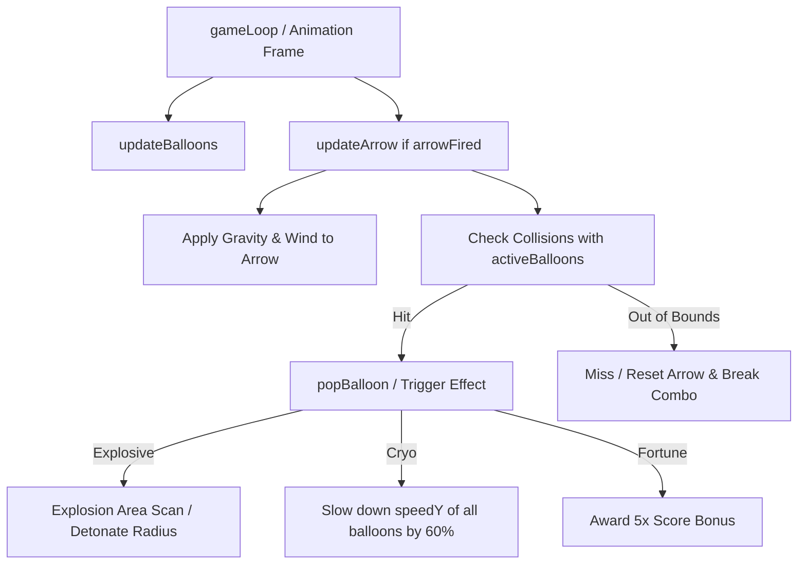

# 📝 TASK-ARCHER: Vento Lateral Dinâmico, Balões Especiais e Multiplicador de Combo

## 👤 User Story
*   **Como** arqueiro no minijogo **The Archer**,
*   **Eu quero** enfrentar a influência de ventos dinâmicos na trajetória das flechas, estourar balões especiais com efeitos únicos e acumular multiplicadores por acertos consecutivos,
*   **Para que** a física do jogo seja mais realista e a pontuação incentive precisão e consistência.

---

## 🎯 Critérios de Aceitação
1.  **Indicador e Influência de Vento Lateral**:
    *   Exibir na interface de usuário (HUD) um indicador visual da força e direção do vento (ex: seta de vento e valor em m/s de -5 a +5).
    *   O vento deve mudar de intensidade e direção a cada 3 tiros ou a cada rodada.
    *   A física da flecha disparada deve sofrer uma força lateral contínua igual à velocidade do vento multiplicada por um fator de sensibilidade, curvando sua trajetória horizontalmente.
2.  **Balões com Efeitos Especiais**:
    *   Adicionar 3 novos tipos de balões que sobem de forma aleatória:
        1.  *Balão de Hélio Instável (Explosivo - Vermelho com Faíscas)*: Ao ser estourado, destrói todos os balões em um raio de 100 pixels.
        2.  *Balão Criogênico (Azul Escuro)*: Reduz em 60% a velocidade de subida de todos os balões ativos na tela por 6 segundos.
        3.  *Balão da Fortuna (Dourado)*: Move-se muito mais rápido e concede pontuação bônus multiplicada por 5.
3.  **Sistema de Combo Streak**:
    *   Cada balão destruído consecutivamente sem errar tiros incrementa a barra de combo.
    *   Adicionar multiplicadores de pontuação visíveis na tela: 2x (a partir de 3 acertos), 3x (a partir de 6 acertos) e 5x (a partir de 10 acertos).
    *   Se qualquer flecha disparada sair da tela ou cair no chão sem atingir nenhum balão, o combo retorna imediatamente a 1x.

---

## 🛠️ Detalhes Técnicos e Arquitetura
*   **Arquivos Alvo**: `/archer/index.html`.
*   **Ajuste da Física**:
    *   Na função de atualização da física da flecha (`arrow.update()` ou similar), aplicar a força do vento sobre o eixo X:
        `arrow.x += arrow.vx + windSpeed * deltaTime;`
*   **Renderização e Estilos**:
    *   Criar um componente de HUD flutuante no topo mostrando uma biruta de vento animada baseada na intensidade (`windSpeed`).
    *   Utilizar sprites ou efeitos CSS `@keyframes` pulsantes para diferenciar os balões especiais dos balões vermelhos convencionais.

---

---

## 📊 Priorização e Estimativa
*   **Prioridade**: Média-Alta (Eleva a jogabilidade básica de casual para competitiva).
*   **Esforço Estimado**: Média (Requer alterações na física básica de projéteis e pooling de objetos para efeitos visuais).
*   **Área**: Front-end / Motor de Física 2D / UI.

---

## 🛠️ Refinamento Técnico (Technical Refinement)

Abaixo estão detalhados os passos de engenharia, a modelagem matemática e os trechos de código necessários para implementar os três novos requisitos da história de usuário, garantindo a consolidação do código do minijogo **The Archer** em [index.html](file:///d:/Users/Home/Documents/repos/playful-hub-sandbox/archer/index.html) (resolvendo as redundâncias e funções duplicadas identificadas no código-fonte) e mantendo a estética premium e lúdica da plataforma.



---

### 1. Consolidação e Limpeza de Funções Duplicadas
O arquivo `archer/index.html` possui duas tags de inicialização de ouvintes de eventos e redefinições redundantes das funções cruciais `updateArrow()`, `checkCollision()`, `resetArrow()`, `initGame()`. O refinamento exige a **unificação do código do script** em uma única declaração limpa que integre:
*   As animações visuais avançadas da primeira versão (partículas de rastro `.arrow-trail-dot`, efeito de pop do balão `.balloon-fragment`, e faísca de lançamento `.launch-spark`).
*   As limitações geométricas de mira (ângulo entre `-0.7 * Math.PI` e `Math.PI / 2`) e os controles de potência da segunda versão.
*   A mudança de balão estático para **sistema de múltiplos balões dinâmicos que sobem pela tela**.

---

### 2. Indicador e Influência de Vento Lateral (Wind Physics System)
*   **Modelo Físico da Trajetória**:
    A física da flecha deve integrar aceleração lateral constante induzida pela velocidade do vento no eixo X.
    Adicionaremos as variáveis globais de vento e calibração:
    
    ```javascript
    let windSpeed = 0.0; // Intensidade de -5.0 a +5.0 m/s
    let windSensitivity = 0.035; // Fator de amortecimento físico para suavizar a trajetória
    let shotCount = 0; // Contador de disparos efetuados
    ```
    
    Na rotina unificada de `updateArrow()`, aplicaremos o vento acumulado no deslocamento de `arrowX`:
    
    ```javascript
    // Aplicação da gravidade no eixo Y
    arrowVelocityY -= gravity;
    
    // Atualização de posição com vento lateral no eixo X
    arrowX += arrowVelocityX + (windSpeed * windSensitivity);
    arrowY += arrowVelocityY;
    
    // Atualiza elementos visuais no Canvas/DOM
    arrow.style.bottom = (90 + arrowY) + 'px';
    arrow.style.left = (145 + arrowX) + 'px';
    ```

*   **HUD do Vento e Biruta Dinâmica**:
    Inserir o widget de medição e direção do vento no canto superior direito do `#game-container`:
    
    ```html
    <div id="wind-hud" style="position: absolute; top: 10px; right: 215px; display: flex; align-items: center; gap: 8px; background: linear-gradient(to bottom, rgba(245, 222, 179, 0.85) 0%, rgba(238, 210, 165, 0.85) 100%); padding: 8px 12px; border-radius: 4px; border: 1px solid #b8860b; color: #502d0e; font-size: 13px; font-weight: bold; box-shadow: inset 0 0 5px rgba(0,0,0,0.1), 2px 2px 4px rgba(0,0,0,0.2);">
        <span>💨 Vento:</span>
        <span id="wind-speed-value" style="min-width: 45px;">0.0 m/s</span>
        <div id="wind-arrow-container" style="display: inline-block; width: 16px; height: 16px; transition: transform 0.4s ease-out;">
            <svg id="wind-arrow" viewBox="0 0 24 24" width="16" height="16" fill="currentColor" style="transition: color 0.3s ease;">
                <path d="M12 2L4.5 20.29l.71.71L12 18l6.79 3 .71-.71z"/>
            </svg>
        </div>
    </div>
    ```

*   **Gerador de Instabilidade Atmosférica**:
    A intensidade e direção do vento devem ser calculadas no início do jogo e a cada 3 tiros disparados:
    
    ```javascript
    function updateWind() {
        // Gera intensidade flutuante entre -5.0 (Esquerda) e +5.0 (Direita)
        windSpeed = parseFloat((Math.random() * 10 - 5).toFixed(1));
        
        const speedValEl = document.getElementById('wind-speed-value');
        const arrowEl = document.getElementById('wind-arrow-container');
        const arrowSvg = document.getElementById('wind-arrow');
        
        if (speedValEl && arrowEl) {
            speedValEl.textContent = `${Math.abs(windSpeed)} m/s ${windSpeed >= 0 ? 'D' : 'E'}`;
            
            // Rotaciona a seta (0deg aponta para cima, 90deg para Direita, -90deg para Esquerda)
            const rotation = windSpeed >= 0 ? 90 : -90;
            const magnitudeScale = 0.6 + (Math.abs(windSpeed) / 5.0) * 0.7; // Seta maior para vento mais forte
            arrowEl.style.transform = `rotate(${rotation}deg) scale(${magnitudeScale})`;
            
            // Altera cor da seta indicando risco climático
            const absSpeed = Math.abs(windSpeed);
            if (absSpeed > 3.5) {
                arrowSvg.style.color = '#e74c3c'; // Alerta Vermelho (Forte)
            } else if (absSpeed > 1.8) {
                arrowSvg.style.color = '#f39c12'; // Laranja (Médio)
            } else {
                arrowSvg.style.color = '#3498db'; // Azul (Fraco)
            }
        }
    }
    ```

---

### 3. Sistema de Pooling de Balões Dinâmicos (Dynamic Spawning Engine)
Substituir o elemento estático de balão vermelho por um **motor de spawning contínuo de balões que sobem de forma autônoma na vertical**.

*   **Definição das Estruturas e Classes de CSS**:
    Remover `#balloon` e `#balloon-string` do arquivo HTML. Adicionar no estilo CSS:
    
    ```css
    /* Estilos Premium dos Balões Especiais */
    .balloon {
        position: absolute;
        width: 40px;
        height: 50px;
        border-radius: 50% 50% 50% 50% / 60% 60% 40% 40%;
        box-shadow: inset -3px -3px 5px rgba(0,0,0,0.2), 0 4px 10px rgba(0,0,0,0.15);
        z-index: 2;
    }
    .balloon::after {
        content: '';
        position: absolute;
        width: 6px;
        height: 6px;
        border-radius: 50%;
        bottom: -3px;
        left: 50%;
        transform: translateX(-50%);
    }
    .balloon-string {
        position: absolute;
        width: 1px;
        height: 30px;
        background-color: rgba(85, 85, 85, 0.6);
        z-index: 1;
    }
    
    /* Radial Gradients Exclusivos */
    .balloon-normal {
        background: radial-gradient(circle at 30% 30%, #ff8888, #ff0000 60%, #cc0000 95%);
    }
    .balloon-normal::after { background: #cc0000; }
    
    .balloon-explosive {
        background: radial-gradient(circle at 30% 30%, #ffbe76, #ff7979 60%, #eb4d4b 95%);
        animation: pulseExplosive 0.8s ease-in-out infinite alternate;
    }
    .balloon-explosive::after { background: #eb4d4b; }
    
    .balloon-cryo {
        background: radial-gradient(circle at 30% 30%, #e0f7fa, #4fc3f7 60%, #0288d1 95%);
        box-shadow: inset -3px -3px 5px rgba(0,0,0,0.2), 0 0 8px rgba(79, 195, 247, 0.6);
    }
    .balloon-cryo::after { background: #0288d1; }
    
    .balloon-fortune {
        background: radial-gradient(circle at 30% 30%, #fff9c4, #fbc02d 60%, #f57f17 95%);
        box-shadow: inset -3px -3px 5px rgba(0,0,0,0.2), 0 0 12px rgba(251, 192, 45, 0.7);
        animation: rotateFortune 3s linear infinite;
    }
    .balloon-fortune::after { background: #f57f17; }
    
    @keyframes pulseExplosive {
        from { transform: scale(1.0); box-shadow: 0 0 5px #eb4d4b; }
        to { transform: scale(1.08); box-shadow: 0 0 15px #ff7979, inset -3px -3px 5px rgba(0,0,0,0.2); }
    }
    @keyframes rotateFortune {
        0% { transform: rotate(-3deg); }
        50% { transform: rotate(3deg); }
        100% { transform: rotate(-3deg); }
    }
    
    /* Efeito de Ondas de Choque (Explosivos) */
    .explosion-effect {
        position: absolute;
        border-radius: 50%;
        background: rgba(235, 77, 75, 0.25);
        border: 2px solid #ff7979;
        pointer-events: none;
        animation: ripple 0.4s ease-out forwards;
        transform-origin: center center;
    }
    @keyframes ripple {
        from { transform: scale(0.1); opacity: 1; }
        to { transform: scale(1.0); opacity: 0; }
    }
    ```

*   **Modelagem de Controle de Objetos (Pooling & Lifecycle)**:
    
    ```javascript
    let activeBalloons = [];
    let balloonCounter = 0;
    let cryoActive = false;
    let cryoTimer = null;
    
    function spawnBalloon() {
        if (gameOver) return;
        
        const id = balloonCounter++;
        
        // Define o tipo com base em distribuição estatística
        const rand = Math.random();
        let type = 'normal';
        if (rand < 0.12) type = 'fortune';     // 12% - Balão Dourado Bônus
        else if (rand < 0.25) type = 'explosive'; // 13% - Balão Explosivo
        else if (rand < 0.38) type = 'cryo';      // 13% - Balão Criogênico
        
        const balloonEl = document.createElement('div');
        balloonEl.className = `balloon balloon-${type}`;
        balloonEl.id = `b-${id}`;
        
        const stringEl = document.createElement('div');
        stringEl.className = 'balloon-string';
        stringEl.id = `s-${id}`;
        
        // Posição de origem horizontal livre no lado direito do canvas (250px a 720px)
        const posX = Math.floor(Math.random() * (720 - 250 + 1)) + 250;
        const startY = -60; // Surge abaixo do limite do canvas
        
        balloonEl.style.left = `${posX}px`;
        balloonEl.style.bottom = `${startY}px`;
        stringEl.style.left = `${posX + 19}px`;
        stringEl.style.bottom = `${startY - 30}px`;
        
        gameContainer.appendChild(balloonEl);
        gameContainer.appendChild(stringEl);
        
        // Velocidades de subida personalizadas
        let speed = 1.0 + Math.random() * 1.5;
        if (type === 'fortune') speed = 3.5 + Math.random() * 2.0; // Super veloz
        
        activeBalloons.push({
            id: id,
            type: type,
            element: balloonEl,
            stringElement: stringEl,
            x: posX,
            y: startY,
            speedY: speed
        });
    }
    ```

*   **Motor do Loop de Movimento (Engine Update Loop)**:
    Como os balões precisam se mover mesmo sem flechas ativas na tela, implementaremos um loop contínuo de renderização gráfica:
    
    ```javascript
    function updateGameLoop() {
        if (gameOver) return;
        
        updateBalloonsPhysics();
        
        requestAnimationFrame(updateGameLoop);
    }
    
    function updateBalloonsPhysics() {
        for (let i = activeBalloons.length - 1; i >= 0; i--) {
            const b = activeBalloons[i];
            
            // Se Cryo estiver ativo, a velocidade de subida é reduzida em 60%
            const slowFactor = cryoActive ? 0.4 : 1.0;
            b.y += b.speedY * slowFactor;
            
            b.element.style.bottom = `${b.y}px`;
            b.stringElement.style.bottom = `${b.y - 30}px`;
            
            // Se ultrapassar a borda superior do canvas (500px), remove do DOM e recria
            if (b.y > 520) {
                cleanupBalloon(b.id);
                activeBalloons.splice(i, 1);
                setTimeout(spawnBalloon, 400);
            }
        }
    }
    
    function cleanupBalloon(id) {
        const el = document.getElementById(`b-${id}`);
        const str = document.getElementById(`s-${id}`);
        if (el) el.remove();
        if (str) str.remove();
    }
    ```

*   **Efeitos de Colisão e Ativação**:
    
    ```javascript
    function handleSpecialBalloonEffect(balloonObj) {
        if (balloonObj.type === 'explosive') {
            triggerVisualExplosion(balloonObj.x + 20, 500 - (balloonObj.y + 25));
        } else if (balloonObj.type === 'cryo') {
            activateCryoTime();
        }
    }
    
    // Varredura de Área para Detonações Recursivas
    function triggerVisualExplosion(centerX, centerY) {
        const radius = 100;
        
        // Renderiza onda de choque
        const exp = document.createElement('div');
        exp.className = 'explosion-effect';
        exp.style.left = `${centerX - radius}px`;
        exp.style.top = `${centerY - radius}px`;
        exp.style.width = `${radius * 2}px`;
        exp.style.height = `${radius * 2}px`;
        gameContainer.appendChild(exp);
        setTimeout(() => exp.remove(), 400);
        
        // Varre balões atingidos no raio de ação
        for (let i = activeBalloons.length - 1; i >= 0; i--) {
            const b = activeBalloons[i];
            const bX = b.x + 20;
            const bY = 500 - (b.y + 25);
            
            const distance = Math.hypot(bX - centerX, bY - centerY);
            if (distance <= radius) {
                popSpecificBalloon(b.id, false); // Estoura sem acionar combo direto adicional
            }
        }
    }
    
    function activateCryoTime() {
        cryoActive = true;
        gameContainer.style.boxShadow = 'inset 0 0 35px rgba(52, 152, 219, 0.45)';
        
        if (cryoTimer) clearTimeout(cryoTimer);
        cryoTimer = setTimeout(() => {
            cryoActive = false;
            gameContainer.style.boxShadow = '0 4px 15px rgba(0, 0, 0, 0.3)';
        }, 6000);
    }
    ```

---

### 4. Sistema de Combo Streak & Multiplicadores
Incentivar tiros precisos consecutivos e penalizar erros de mira.

*   **Modelagem do Streak**:
    
    ```javascript
    let comboCount = 0;
    let comboMultiplier = 1;
    ```
    
    Ao atingir diretamente qualquer balão:
    *   Incrementa `comboCount++`.
    *   Calcula o multiplicador:
        *   `comboCount >= 10`: **5x**
        *   `comboCount >= 6`: **3x**
        *   `comboCount >= 3`: **2x**
        *   Outros: **1x**
    *   A pontuação final é dada por: `pontos_base * comboMultiplier * (tipo_fortune ? 5 : 1)`.

    Ao errar o tiro (flecha colidir com o chão ou sair da tela sem acertos):
    *   Reseta instantaneamente `comboCount = 0;` e `comboMultiplier = 1;`.
    *   Exibir micro-alerta de "COMBO BREAK" flutuante.

*   **HUD do Combo**:
    Adicionar um indicador visual piscante e dinâmico ao lado das flechas:
    
    ```html
    <div id="combo-hud" style="position: absolute; top: 100px; left: 10px; background: linear-gradient(to bottom, rgba(46, 204, 113, 0.2) 0%, rgba(39, 174, 96, 0.3) 100%); padding: 6px 12px; border-radius: 4px; border: 1px dashed #2ecc71; color: #2ecc71; font-size: 13px; font-weight: bold; min-width: 100px; display: none; text-align: center; animation: glowPulse 1.5s infinite alternate;">
        🔥 COMBO: <span id="combo-val">0</span> (<span id="combo-mult">1x</span>)
    </div>
    
    <style>
    @keyframes glowPulse {
        from { box-shadow: 0 0 2px rgba(46, 204, 113, 0.3); border-color: #2ecc71; }
        to { box-shadow: 0 0 10px rgba(46, 204, 113, 0.7); border-color: #27ae60; }
    }
    </style>
    ```

*   **Lógica de Atualização Visual**:
    
    ```javascript
    function updateComboHUD() {
        const hud = document.getElementById('combo-hud');
        const comboVal = document.getElementById('combo-val');
        const comboMult = document.getElementById('combo-mult');
        
        if (comboCount >= 3) {
            hud.style.display = 'block';
            comboVal.textContent = comboCount;
            comboMult.textContent = `${comboMultiplier}x`;
            
            // Modificações cromáticas de acordo com o multiplicador para ostentação estética
            if (comboMultiplier === 5) {
                hud.style.background = 'linear-gradient(to bottom, rgba(231, 76, 60, 0.3) 0%, rgba(192, 41, 43, 0.4) 100%)';
                hud.style.color = '#e74c3c';
                hud.style.borderColor = '#e74c3c';
            } else if (comboMultiplier === 3) {
                hud.style.background = 'linear-gradient(to bottom, rgba(243, 156, 18, 0.25) 0%, rgba(211, 84, 0, 0.35) 100%)';
                hud.style.color = '#f39c12';
                hud.style.borderColor = '#f39c12';
            } else {
                hud.style.background = 'linear-gradient(to bottom, rgba(46, 204, 113, 0.2) 0%, rgba(39, 174, 96, 0.3) 100%)';
                hud.style.color = '#2ecc71';
                hud.style.borderColor = '#2ecc71';
            }
        } else {
            hud.style.display = 'none';
        }
    }
    ```

---

### 5. Ciclo de Reset de Estado Integrado
A chamada a `initGame()` deve redefinir o estado dos ventos, combo, esvaziar elementos residuais do DOM e popular o vetor inicial de 3 balões dinâmicos:

```javascript
function initGame() {
    score = 0;
    arrowsLeft = 5;
    gameOver = false;
    shotCount = 0;
    comboCount = 0;
    comboMultiplier = 1;
    cryoActive = false;
    if (cryoTimer) clearTimeout(cryoTimer);
    
    // Limpa balões ativos do DOM e array
    activeBalloons.forEach(b => cleanupBalloon(b.id));
    activeBalloons = [];
    
    scoreElement.textContent = score;
    arrowsCounter.textContent = arrowsLeft;
    gameOverElement.style.display = 'none';
    
    resetArrow();
    powerIndicator.style.display = 'none';
    powerBar.style.height = '0%';
    
    // Gera vento inicial
    updateWind();
    updateComboHUD();
    
    // Spawna 3 balões de início
    for (let i = 0; i < 3; i++) {
        setTimeout(spawnBalloon, i * 300);
    }
    
    // Inicia os loops de atualização
    updateGameLoop();
}
```

