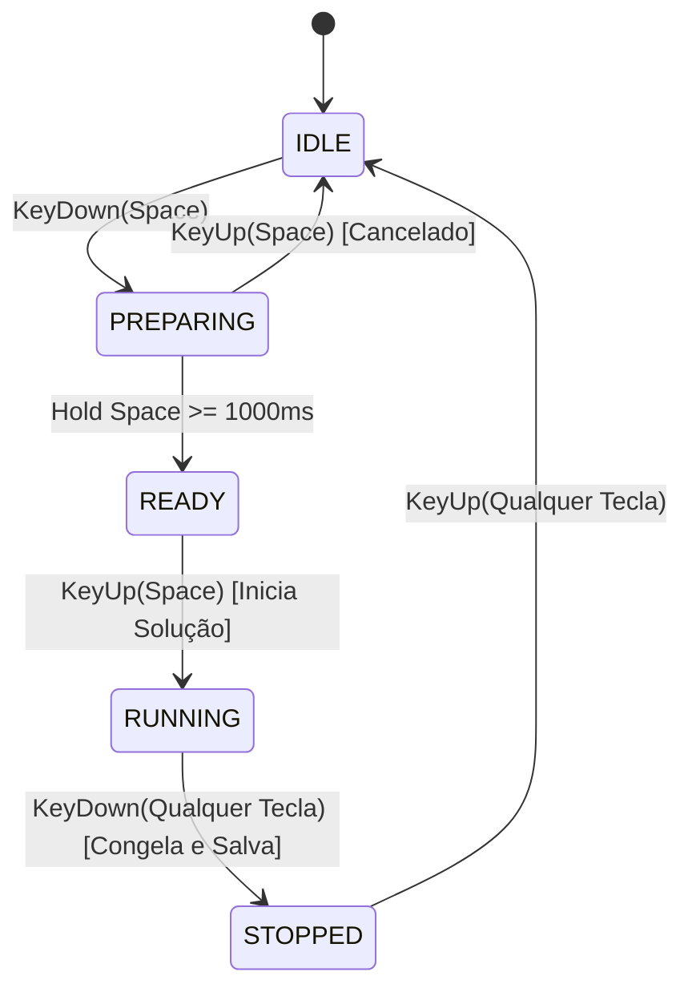

# 📝 TASK-RUBIKS_CUBE: Resolvedor Automático de Cubo Mágico, Cronômetro Oficial Speedcubing e Estatísticas (Ao5 / Ao12)

## 👤 User Story
*   **Como** praticante iniciante ou avançado de Speedcubing no minijogo 3D **Rubik's Cube**,
*   **Eu quero** acionar um resolvedor automático baseado em algoritmos inteligentes que me guie passo a passo, treinar com um cronômetro no padrão oficial da WCA e registrar meu histórico pessoal de tempos de resolução com cálculo de médias,
*   **Para que** eu aprenda o método de montagem e possa mensurar e aprimorar minha velocidade de resolução na prática.

---

## 🎯 Critérios de Aceitação
1.  **Resolvedor Automático (Auto-Solver)**:
    *   Criar um botão "Auto-Resolver" na barra de ferramentas lateral.
    *   O algoritmo deve ler a matriz de cores tridimensional atual do cubo misturado e gerar a lista de movimentos de rotação oficiais (Notação da World Cube Association: U, D, R, L, F, B, e suas versões horárias/anti-horárias com apóstrofo).
    *   Executar as animações de rotação 3D correspondentes de forma suave e controlável pelo jogador (ex: botões de Play, Pause, e velocidade da animação).
2.  **Cronômetro Estilo WCA Stackmat**:
    *   Integrar um cronômetro na tela principal ativado pelo teclado:
        *   *Preparação*: O jogador mantém pressionada a barra de espaço. O visor do cronômetro acende em vermelho e, após 1 segundo, fica verde, indicando que está pronto.
        *   *Início*: Ao soltar a barra de espaço, o cronômetro começa a contar milissegundos instantaneamente.
        *   *Parada*: Ao concluir a resolução do cubo, o jogador pressiona qualquer tecla para congelar o cronômetro.
3.  **Histórico e Médias de Velocidade (Solves Logger)**:
    *   Ao parar o cronômetro, salvar o tempo em milissegundos e a data no `localStorage`.
    *   Exibir uma tabela lateral listando os últimos 10 tempos resolvidos.
    *   Calcular e atualizar em tempo real as métricas clássicas de competição:
        *   **Ao5 (Average of 5)**: Média aritmética dos últimos 5 tempos, descartando o melhor e o pior tempo do grupo de 5.
        *   **Ao12 (Average of 12)**: Média aritmética dos últimos 12 tempos, descartando o melhor e o pior.

---

## 🛠️ Detalhes Técnicos e Arquitetura
*   **Arquivos Alvo**: `/rubiks_cube/index.html`.
*   **Motor Lógico do Cubo**:
    *   Integrar um script resolvedor simples (ex: método de camadas simplificado ou algoritmo de duas fases Kociemba portado em JavaScript leve) que resolve o estado lógico do cubo em menos de 100 milissegundos de processamento local.
*   **Controles 3D e Animações**:
    *   Na animação do solver, garantir que as rotações de faces 3D não entrem em conflito com inputs manuais do mouse do jogador (desabilitar rotação manual durante a execução do auto-solver).
*   **Interface Gráfica**:
    *   Design moderno, minimalista e focado no speedcubing, com fontes de display digital de LED de alta legibilidade para o cronômetro.

---

## 📊 Priorização e Estimativa
*   **Prioridade**: Muito Alta (Fator de engajamento definitivo para os fãs de cubo mágico 3D).
*   **Esforço Estimado**: Alta (O resolvedor lógico exige tratamento matricial complexo de permutações de arestas e cantos do cubo).
*   **Área**: Front-end / Computação Gráfica 3D (WebGL/ThreeJS se aplicável) / Algoritmos de Busca.

---

## 🏗️ Refinamento Técnico

Para garantir uma implementação impecável que atenda aos rígidos critérios de aceitação do Product Owner, garantindo 60 FPS estáveis, física consistente e controle total sobre o cubo, esta seção define a especificação da arquitetura, estruturas de dados, fluxos de controle e layout visual.

### 1. Modelo de Leitura Lógica do Cubo 3D (Coordenadas para Facelets)

O resolvedor automático exige que o estado atual do cubo em 3D seja mapeado em uma string plana de 54 caracteres contendo as letras correspondentes a cada face (`u`, `d`, `l`, `r`, `f`, `b`). 

Como os cubos sofrem rotações arbitrárias, o mapeamento deve ser feito de forma dinâmica e robusta:
1. **Identificação Dinâmica de Cores**: Identificamos qual cor corresponde a qual face mapeando os 6 cubos centrais fixos do cubo (que nunca alteram suas posições relativas):
   * Centro **U** (Up): Cubie posicionado em `y = 1.05` (snapped) com `x = 0, z = 0` (local coordinates offset).
   * Centro **D** (Down): Cubie posicionado em `y = -1.05` com `x = 0, z = 0`.
   * Centro **F** (Front): Cubie posicionado em `z = 1.05` com `x = 0, y = 0`.
   * Centro **B** (Back): Cubie posicionado em `z = -1.05` com `x = 0, y = 0`.
   * Centro **L** (Left): Cubie posicionado em `x = -1.05` com `y = 0, z = 0`.
   * Centro **R** (Right): Cubie posicionado em `x = 1.05` com `y = 0, z = 0`.

2. **Cálculo da Orientação das Cores de Cada Cubie**: Para determinar qual cor está voltada para cima, frente, etc., usamos a transformação do vetor normal local do material do cubie em direção ao mundo 3D:
   ```javascript
   const localNormals = [
       new THREE.Vector3(1, 0, 0),   // Índice 0: +X (Right)
       new THREE.Vector3(-1, 0, 0),  // Índice 1: -X (Left)
       new THREE.Vector3(0, 1, 0),   // Índice 2: +Y (Up)
       new THREE.Vector3(0, -1, 0),  // Índice 3: -Y (Down)
       new THREE.Vector3(0, 0, 1),   // Índice 4: +Z (Front)
       new THREE.Vector3(0, 0, -1)   // Índice 5: -Z (Back)
   ];

   function getWorldFaceColor(cubie, worldDirection) {
       for (let i = 0; i < 6; i++) {
           const localNorm = localNormals[i];
           const worldNorm = localNorm.clone().transformDirection(cubie.matrixWorld).round();
           if (worldNorm.equals(worldDirection)) {
               return cubie.material[i].color.getHex();
           }
       }
       return null;
   }
   ```

3. **Mapeamento de Coordenadas de Facelet**: A ordem na string de 54 caracteres é dividida em blocos de 9 caracteres para cada face na ordem exata: `Front`, `Right`, `Up`, `Down`, `Left`, `Back`. Dentro de cada face, lemos os cubies de cima para baixo, da esquerda para a direita (como lendo um livro).
   
   A tabela a seguir estabelece as coordenadas snapped (`gridX`, `gridY`, `gridZ` em `0, 1, 2`) para o mapeamento preciso de cada slot:

   * **Front (F)** (`gridZ === 2`):
     * Linha 0 (Top): `gridY = 2` -> Coluna `gridX = 0, 1, 2`
     * Linha 1 (Mid): `gridY = 1` -> Coluna `gridX = 0, 1, 2`
     * Linha 2 (Bot): `gridY = 0` -> Coluna `gridX = 0, 1, 2`
   * **Right (R)** (`gridX === 2`):
     * Linha 0 (Top): `gridY = 2` -> Coluna `gridZ = 2, 1, 0`
     * Linha 1 (Mid): `gridY = 1` -> Coluna `gridZ = 2, 1, 0`
     * Linha 2 (Bot): `gridY = 0` -> Coluna `gridZ = 2, 1, 0`
   * **Up (U)** (`gridY === 2`):
     * Linha 0 (Top): `gridZ = 0` -> Coluna `gridX = 0, 1, 2`
     * Linha 1 (Mid): `gridZ = 1` -> Coluna `gridX = 0, 1, 2`
     * Linha 2 (Bot): `gridZ = 2` -> Coluna `gridX = 0, 1, 2`
   * **Down (D)** (`gridY === 0`):
     * Linha 0 (Top): `gridZ = 2` -> Coluna `gridX = 0, 1, 2`
     * Linha 1 (Mid): `gridZ = 1` -> Coluna `gridX = 0, 1, 2`
     * Linha 2 (Bot): `gridZ = 0` -> Coluna `gridX = 0, 1, 2`
   * **Left (L)** (`gridX === 0`):
     * Linha 0 (Top): `gridY = 2` -> Coluna `gridZ = 0, 1, 2`
     * Linha 1 (Mid): `gridY = 1` -> Coluna `gridZ = 0, 1, 2`
     * Linha 2 (Bot): `gridY = 0` -> Coluna `gridZ = 0, 1, 2`
   * **Back (B)** (`gridZ === 0`):
     * Linha 0 (Top): `gridY = 2` -> Coluna `gridX = 2, 1, 0`
     * Linha 1 (Mid): `gridY = 1` -> Coluna `gridX = 2, 1, 0`
     * Linha 2 (Bot): `gridY = 0` -> Coluna `gridX = 2, 1, 0`

### 2. Integração e Tradução do Resolvedor (Solver)

Adicionaremos a biblioteca ultra leve `rubiks-cube-solver` via CDN no HTML:
```html
<script src="https://cdn.jsdelivr.net/npm/rubiks-cube-solver@1.1.2/dist/bundle.js"></script>
```

#### Tradução e Fluxo do Solucionador
O solver retorna a solução dividida em fases ou como uma string de movimentos padrão WCA. Faremos o parse dessas rotações e as empilharemos na fila `moveQueue` do jogo:
* Rotações horárias (`U`, `D`, `F`, `B`, `L`, `R`): Mapeado com `angle = -Math.PI / 2` (ou direção correspondente no script original do jogo).
* Rotações anti-horárias (`U'`, `D'`, etc. - retornadas como `Uprime` ou `U'`): Mapeado invertendo a direção do ângulo original.
* Rotações duplas (`U2`, `R2`, etc.): Mapeado empilhando **dois** movimentos consecutivos de 90° na mesma direção no `moveQueue`. Isso evita a necessidade de implementar novas físicas de rotação e mantém a fluidez visual do cubo.

Durante a execução das animações do Solver:
* O mouse do jogador deve ter `controls.enabled = false` para desabilitar a rotação de câmera e a interação de arrastar as faces 3D.
* Criaremos um controlador global de velocidade que ajustará o tempo do Tween em tempo real (ex: de `100ms` para velocidade turbo até `1000ms` para velocidade de aprendizado lenta).

### 3. Máquina de Estados do Cronômetro WCA Stackmat

Para reproduzir a experiência exata de um cronômetro profissional da WCA, implementaremos a seguinte máquina de estados no teclado vinculada à barra de espaço:



#### Detalhes Lógicos do Stackmat:
* **Fase PREPARING (Visor Vermelho)**: Quando o jogador segura a barra de espaço, iniciamos um `setTimeout` de 1000ms e mostramos o visor em vermelho.
* **Fase READY (Visor Verde)**: Se o jogador segurar por 1 segundo inteiro, o visor acende em verde vibrante, indicando prontidão absoluta. O cronômetro zera para `0.000` na tela.
* **Fase RUNNING (Cronometragem Ativa)**: Ao soltar o espaço, o timer inicia. Para altíssima precisão de milissegundos sem travamento do frame do navegador, usamos `performance.now()` ou `Date.now()`. O loop de renderização atualiza a tela a cada frame.
* **Fase STOPPED (Congelamento de Tempo)**: Assim que o jogador clica em qualquer tecla (ex: finalizando a montagem), gravamos o tempo preciso, exibimos em destaque e salvamos a solve.

### 4. Lógica de Histórico, Persistência e Cálculo de Médias (Ao5 / Ao12)

Os resultados das resoluções bem-sucedidas serão persistidos no `localStorage` sob a chave `playful_hub_rubiks_solves`:
```typescript
interface Solve {
  id: string;
  timeMs: number;
  date: string; // ISO String
}
```

#### Fórmulas de Média WCA:
1. **Ao5 (Average of 5)**:
   * Requisito: Ter pelo menos 5 resoluções no histórico.
   * Algoritmo: Pega as últimas 5 resoluções do array de histórico. Ordena os 5 tempos de forma crescente. Descarta o menor tempo (melhor resultado) e o maior tempo (pior resultado). Calcula a média aritmética simples dos 3 tempos restantes.
2. **Ao12 (Average of 12)**:
   * Requisito: Ter pelo menos 12 resoluções no histórico.
   * Algoritmo: Pega as últimas 12 resoluções do array de histórico. Ordena os 12 tempos de forma crescente. Descarta o melhor e o pior tempo. Calcula a média aritmética simples dos 10 tempos restantes.

### 5. Especificação de Design da Interface Premium

A interface atual do cubo será drasticamente aprimorada para exibir um design futurista, minimalista e focado em Speedcubing (combinação de Dark Theme, Neon Colors e Glassmorphism):

* **Layout Flexbox Horizontal**: O cubo 3D ficará na esquerda (70% da tela) e a barra lateral de estatísticas/histórico na direita (30% da tela) em telas widescreen.
* **Display Digital do Cronômetro**:
  * Posição centralizada no topo do container do cubo.
  * Fonte digital retro/futurista do Google Fonts (ex: `Share Tech Mono` ou `Orbitron`).
  * Efeitos de brilho glow de LED de acordo com o estado do Stackmat:
    * Vermelho Neon (`rgba(255, 75, 75, 0.9)`) durante `PREPARING`.
    * Verde Neon (`rgba(75, 255, 75, 0.9)`) durante `READY`.
    * Azul Ice/Branco (`rgba(255, 255, 255, 0.95)`) com sombra difusa glow durante `RUNNING`.
* **Painel Lateral de Estatísticas (Solves Logger)**:
  * Um container estilo vidro fosco (`backdrop-filter: blur(10px)`) com borda fina e sombra suave.
  * Tabela com as últimas 10 solves formatadas em minutos e segundos com precisão de 3 casas decimais (ex: `01:23.456`).
  * Cards de visualização rápida para o **Best Time** (Recorde Pessoal), **Ao5** e **Ao12**.
  * Botão de "Limpar Histórico" com pop-up de confirmação rápida para evitar exclusões acidentais.
* **Barra de Controles do Auto-Solver**:
  * Um card inferior com os botões de controle de reprodução do solucionador automático:
    * Botão **Play/Pause**: Inicia ou pausa a animação passo a passo do resolvedor.
    * Botões **Anterior/Próximo (Step-by-step)**: Permite avançar ou retroceder um movimento manualmente com o resolvedor pausado.
    * Slider de **Velocidade (Speed)**: Ajusta o intervalo de animação (de 1.5x mais lento para visualização didática até 4x mais rápido para resoluções imediatas).
    * Indicador de Texto mostrando o movimento atual (ex: `Passo 12/28: R'`).
