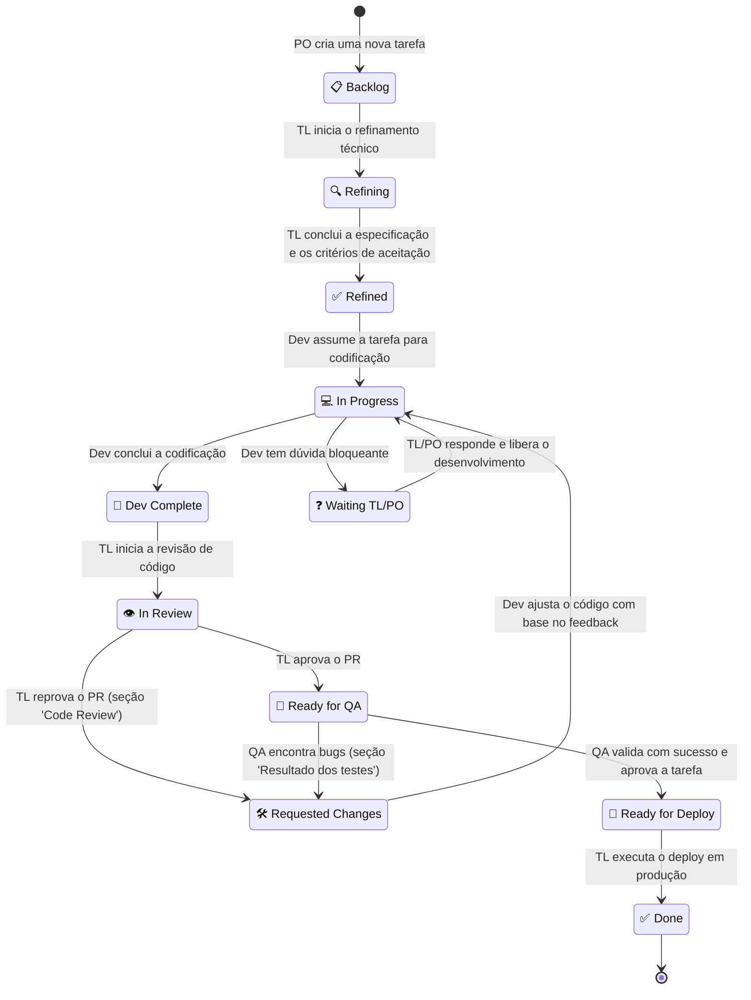

# 🔄 Fluxo de Trabalho e Ciclo de Vida das Tarefas (Workflow)

Este documento descreve o sistema de organização e ciclo de vida de desenvolvimento adotado no **Playful Hub**. O arquivo `BACKLOG.md` **na raiz do repositório** funciona como a nossa **base de dados central e fonte única de verdade** de tarefas, onde agentes de IA e desenvolvedores humanos colaboram, analisam e movem tarefas ao longo das etapas de desenvolvimento através da atualização de seus respectivos estados.

> **Importante**: os arquivos `BACKLOG.md` presentes dentro das pastas de cada jogo são legado/read-only. **Somente** o `BACKLOG.md` da raiz é válido para rastreamento de status, prioridade e dono da tarefa.

---

## 🗺️ Glossário de Status (Vocabulário Canônico)

Os rótulos abaixo são os **únicos valores válidos** para a coluna `Status` do `BACKLOG.md` (raiz). Todo agente **deve** usar exatamente esses rótulos, incluindo emoji e caixa alta/baixa, para que a identificação de tarefas funcione de forma determinística e sem colisão.

| Rótulo canônico | Quem move para este estado | Significado |
| :--- | :--- | :--- |
| `📋 Backlog` | PO | Nova demanda criada, aguardando refinamento técnico |
| `🔍 Refining` | TL | Refinamento técnico em andamento |
| `✅ Refined` | TL | Especificação e critérios de aceitação prontos para desenvolvimento |
| `💻 In Progress` | Dev | Desenvolvimento em andamento |
| `🚀 Dev Complete` | Dev | Código concluído e validado localmente, aguardando revisão |
| `👁️ In Review` | TL | Code review em andamento |
| `🛠️ Requested Changes` | TL / QA | Correções solicitadas (via Code Review ou Testes) |
| `🧪 Ready for QA` | TL | Aprovado em code review, aguardando testes |
| `🎉 Ready for Deploy` | QA | Testes aprovados, aguardando deploy |
| `❓ Waiting TL/PO` | Dev | Dúvida bloqueante aguardando resposta do TL/PO |
| `✅ Done` | TL | Implantado em produção (estado final) |

> ⚠️ **Migração pendente no `BACKLOG.md`** para total aderência a este glossário: `🎉 Ready for deploy` → `🎉 Ready for Deploy` e `Ready for QA` → `🧪 Ready for QA`.

---

## 🗺️ Visão Geral do Fluxo (Mermaid Diagram)

Abaixo está o diagrama visual detalhando todos os estados e transições do ciclo de vida de uma tarefa na plataforma:

> O laço `Requested Changes → In Progress → Dev Complete → In Review` é **sempre** percorrido, independentemente de a rejeição ter vindo do TL (code review) ou do QA (testes). Ou seja, após qualquer correção, a tarefa passa novamente por Code Review antes de retornar ao QA.

---

## 🛡️ Regras de Concorrência (Protocolo Anti-Colisão)

Estas regras existem para orquestrar o time de agentes **sem colisão de trabalho**. São obrigatórias para todos os papéis.

1. **Uma tarefa por agente por vez**: cada agente trabalha em **no máximo uma** tarefa simultaneamente.
2. **Claim atômico ("puxar")**: "puxar" uma tarefa é uma operação de 3 passos sobre a tabela do `BACKLOG.md` (raiz):
   1. registrar o **nome do agente** na coluna `Responsável`;
   2. alterar o `Status` para o estado de entrada do seu papel;
   3. **reler** o `BACKLOG.md` e confirmar que a linha continua como você deixou. Se outro agente alterou a mesma linha no meio do caminho, o claim é inválido: reverta e escolha outra tarefa.
3. **Único escritor / reler antes de salvar**: o `BACKLOG.md` é um arquivo único e compartilhado. Antes de qualquer gravação, **releia a versão atual** e nunca sobrescreva alterações de terceiros. Em caso de conflito, desfaça e repita a operação a partir do estado atual do arquivo.
4. **Ownership**: enquanto a tarefa estiver sob sua responsabilidade, mantenha seu nome na coluna `Responsável`. Ao entregá-la para o próximo papel (mudança de estado que transfere a responsabilidade), **limpe** o campo.
5. **Não edite o código/arquivos de uma tarefa que você não possui**: não há compartilhamento de uma mesma tarefa entre agentes.
6. **`PO_DUVIDAS.md`**: cada papel só **adiciona ou marca como lidas** as suas **próprias** entradas, sem reescrever o arquivo inteiro, para evitar perda de mensagens de outros papéis.

---

## 🧑‍💻 Papéis e Estados do Ciclo de Vida

### 1. Criação de nova demanda (PO)
*   **Ação**: O PO responsável pelo projeto elabora uma tarefa nova e a cadastra com o status `📋 Backlog` na tabela do `BACKLOG.md` (raiz). Antes, veja se existe alguma mensagem para você no arquivo `PO_DUVIDAS.md`; se existir, leia e marque as questões como ✅ (já lidas), **sem alterar** as entradas de outros papéis.

### 2. Refinamento Técnico (TL)
*   **Ação**: O Tech Lead busca a primeira tarefa disponível com o status `📋 Backlog`, do topo da tabela. Antes, veja se existe alguma mensagem para você no arquivo `PO_DUVIDAS.md`; se existir, leia e marque as questões como ✅ (já lidas).
*   **Transição de Status**:
    *   Ao iniciar o trabalho: muda para `🔍 Refining`.
    *   Ao concluir a especificação técnica: muda para `✅ Refined`.
*   **O que é feito**: O arquivo `TASK_00N.md` correspondente ao jogo é estruturado com a especificação de requisitos completos, critérios de aceitação claros, modelagem de dados, estratégias de Pooling de objetos e demais arquiteturas de desenvolvimento.
*   Se não houver tarefas em `📋 Backlog`, não faça nada.

### 3. Desenvolvimento e Codificação (Dev)
*   **Ação**: O programador busca a primeira tarefa disponível com o status `✅ Refined`, do topo da tabela. **Antes** de pegar uma tarefa nova, verifique se existe alguma tarefa em `🛠️ Requested Changes` que seja sua para corrigir — ajustes de revisão/testes têm **prioridade** sobre tarefas novas. Também veja o arquivo `PO_DUVIDAS.md` para conferir algo importante para a sua tarefa.
*   **Claim obrigatório**: ao assumir a tarefa, siga o protocolo de concorrência (seção "Regras de Concorrência").
*   **Transição de Status**:
    *   Ao iniciar o desenvolvimento: muda para `💻 In Progress`.
    *   Se surgir alguma dúvida **bloqueante** durante o desenvolvimento: registre-a na seção `## ❓ Dúvidas para o TL ou o PO` do `TASK_00N.md` correspondente e mude o status para `❓ Waiting TL/PO`.
    *   Ao finalizar o código e **garantir o funcionamento local**: muda para `🚀 Dev Complete`.
*   **Critério "funcionamento local"**: a tarefa só deve ir para `🚀 Dev Complete` se o agente validou localmente os critérios de aceitação — rodando o jogo/servidor e, quando existirem, executando os testes disponíveis (ex.: `npm run test:ci` na raiz ou a suíte específica do jogo em `tests/`).
*   Se não houver tarefas, não faça nada.

### 4. Revisão de Código e Suporte (Tech Lead - TL)
*   **Prioridade (nesta ordem)**:
    1. Responder tarefas no status `❓ Waiting TL/PO`;
    2. Revisar tarefas no status `🚀 Dev Complete`;
    3. Refinar tarefas no status `📋 Backlog` (item 2).
*   **Responder dúvida (`❓ Waiting TL/PO`)**: responda as perguntas do desenvolvedor na seção `## ❓ Dúvidas para o TL ou o PO` do `TASK_00N.md`, tomando decisões conservadoras — mantenha a aplicação estável acima de tudo e observe os padrões de segurança. Ao responder, devolva o status para `💻 In Progress` para o desenvolvedor retomar.
*   **Revisão de Código**:
    *   Ao iniciar a revisão de código / Pull Request: muda para `👁️ In Review`.
    *   **Opção A (Reprovado)**: Se o código não atender aos padrões arquiteturais, de otimização ou boas práticas, o status muda para `🛠️ Requested Changes`.
        *   *Ação Obrigatória*: O TL deve criar uma nova seção no arquivo da task (`TASK_00N.md` do jogo correspondente) chamada `## 🔍 Code Review`, detalhando os pontos de melhoria necessários.
    *   **Opção B (Aprovado)**: Se o código for aceito, o status muda para `🧪 Ready for QA`.
*   Se não houver tarefas, não faça nada.

### 5. Garantia de Qualidade (QA)
*   **Ação**: O analista de QA busca a primeira tarefa com o status `🧪 Ready for QA`, do topo da tabela, para testar os critérios de aceitação estabelecidos. Também veja o arquivo `PO_DUVIDAS.md` para conferir algo importante para a sua tarefa.
*   **Transição de Status**:
    *   **Opção A (Falha nos testes)**: Se o QA encontrar bugs ou discrepâncias em relação aos critérios de aceitação originais, o status muda para `🛠️ Requested Changes`.
        *   *Ação Obrigatória*: O QA deve adicionar uma seção no arquivo de task correspondente chamada `## 🧪 Resultado dos testes`, detalhando as observações, bugs encontrados e passos para reproduzi-los.
    *   **Opção B (Sucesso)**: Se passar em todos os testes, o status muda para `🎉 Ready for Deploy`.
*   Se não houver tarefas, não faça nada.

### 6. Deploy (Tech Lead - TL)
*   **Ação**: O Tech Lead busca a primeira tarefa no status `🎉 Ready for Deploy`, executa a implantação em produção e, ao concluir, move o status para `✅ Done` (estado final).
*   Se não houver tarefas, não faça nada.

---

## 📝 Regras Gerais Importantes para os Agentes de IA

1.  **Puxar uma tarefa**: "Puxar" uma tarefa significa executar o **claim atômico** descrito na seção "Regras de Concorrência" (registrar `Responsável`, alterar o `Status` no `BACKLOG.md` da raiz e reler o arquivo para confirmar a posse).
2.  **Ordem de prioridade**: Sempre priorize tarefas do **topo da tabela** *dentro do status alvo do seu papel* — isto garante que as tarefas mais antigas ou de maior prioridade daquele estado sejam finalizadas primeiro.
3.  **Documentação de feedbacks**: Sempre que uma tarefa voltar para o status `🛠️ Requested Changes` devido a Code Review ou Testes de QA, as respectivas seções de diagnóstico (`## 🔍 Code Review` ou `## 🧪 Resultado dos testes`) **devem** ser criadas e populadas no arquivo específico da tarefa correspondente (`TASK_00N.md` do minijogo) para servir de insumo para os ajustes do programador.
4.  **Fonte de verdade**: todo rastreamento de status/prioridade/responsável ocorre exclusivamente no `BACKLOG.md` da raiz. Os `BACKLOG.md` internos de cada jogo não devem ser usados para este fim.
