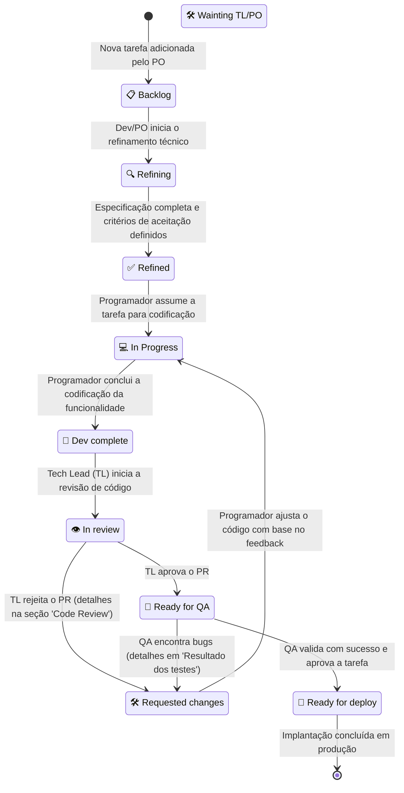

# 🔄 Fluxo de Trabalho e Ciclo de Vida das Tarefas (Workflow)

Este documento descreve o sistema de organização e ciclo de vida de desenvolvimento adotado no **Playful Hub**. O arquivo `BACKLOG.md` na raiz funciona como a nossa **base de dados central de tarefas**, onde agentes de IA e desenvolvedores humanos colaboram, analisam e movem tarefas ao longo das etapas de desenvolvimento através da atualização de seus respectivos estados.

---

## 🗺️ Visão Geral do Fluxo (Mermaid Diagram)

Abaixo está o diagrama visual detalhando todos os estados e transições do ciclo de vida de uma tarefa na plataforma:

---

## 🧑‍💻 Papéis e Estados do Ciclo de Vida

### 1. Refinamento Técnico (Dev / PO)
*   **Ação**: O desenvolvedor ou Product Owner responsável pelo refinamento busca a primeira tarefa disponível com o status `📋 Backlog`. Mas antes, veja se existe alguma mensagem pra vc no arquivo PO_DUVIDAS.md, se tiver, leia e marque as questões como ✅ (ja lidas).
*   **Transição de Status**:
    *   Ao iniciar o trabalho: muda para `Refining`.
    *   Ao concluir a especificação técnica: muda para `✅ Refined`.
*   **O que é feito**: O arquivo `TASK_002.md` correspondente ao jogo é estruturado com a especificação de requisitos completos, critérios de aceitação claros, modelagem de dados, estratégias de Pooling de objetos e demais 
arquiteturas de desenvolvimento.
* Se não tiver tarefas, não faça nada.

### 2. Desenvolvimento e Codificação (Programador)
*   **Ação**: O programador busca a primeira tarefa disponível com o status `✅ Refined`. Mas primeiro veja se tem alguma task em `Requested changes` para arrumar alguma coisa antes de pegar uma tarefa nova.
*   **Transição de Status**:
    *   Ao iniciar o desenvolvimento: muda para `In Progress`.
    *   Ao finalizar o código e garantir o funcionamento local: muda para `Dev complete`.
    *   Se tiver alguma dúvida que necessite ser respondida antes de iniciar, deixe a dúvida na sessão "❓ Dúvidas para o TL ou o PO" e mude o status para "Wainting TL/PO"
* Se não tiver tarefas, não faça nada.

### 3. Revisão de Código (Tech Lead - TL)
*   **Ação**: O Tech Lead analisa a primeira tarefa que encontrar no status `Dev complete`, mas antes veja se tem alguma tarefa no status "🛠️ Wainting TL/PO", vá até ela e responda as perguntas do desenvolvedor, tome as decisões de maneira conservadora sempre pensando manter a aplicação estável acima de tudo e pensando em padrões de segurança, depois pode pegar uma tarefa pra refinar.
*   **Transição de Status**:
    *   Ao iniciar a revisão de código / Pull Request: muda para `In review`.
    *   **Opção A (Reprovado)**: Se o código não atender aos padrões arquiteturais, de otimização ou boas práticas, o status muda para `Requested changes`.
        *   *Ação Obrigatória*: O TL deve criar uma nova seção no arquivo da task (`TASK_002.md` do jogo correspondente) chamada `## 🔍 Code Review` detalhando os pontos de melhoria necessários.
    *   **Opção B (Aprovado)**: Se o código for aceito, o status muda para `Ready for QA`.
    * Se não tiver tarefas, não faça nada.
* Se não tiver tarefas, não faça nada.

### 4. Garantia de Qualidade (QA)
*   **Ação**: O analista de QA busca a primeira tarefa com o status `Ready for QA` para testar os critérios de aceitação estabelecidos.
*   **Transição de Status**:
    *   **Opção A (Falha nos testes)**: Se o QA encontrar bugs ou discrepâncias em relação aos critérios de aceitação originais, o status muda para `Requested changes`.
        *   *Ação Obrigatória*: O QA deve adicionar uma seção no arquivo de task correspondente chamada `## 🧪 Resultado dos testes`, detalhando as observações, bugs encontrados e passos para reproduzi-los.
    *   **Opção B (Sucesso)**: Se passar em todos os testes, o status muda para `Ready for deploy`.
* Se não tiver tarefas, não faça nada.

---

## 📝 Regras Gerais Importantes para os Agentes de IA

1.  **Puxar uma tarefa**: "Puxar" uma tarefa significa estritamente alterar seu status no arquivo global `BACKLOG.md`.
2.  **Ordem de prioridade**: Sempre priorize tarefas do topo da tabela para garantir que as tarefas mais antigas ou de maior prioridade sejam finalizadas primeiro.
3.  **Documentação de feedbacks**: Sempre que uma tarefa voltar para o status `Requested changes` devido a Code Review ou Testes de QA, as respectivas seções de diagnóstico (`## 🔍 Code Review` ou `## 🧪 Resultado dos testes`) **devem** ser criadas e populadas no arquivo específico da tarefa correspondente (`TASK_002.md` do minijogo) para servir de insumo para os ajustes do programador.
