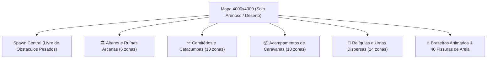

# 🏜️ TASK-BLOOD_AND_SILVER_016: Textura de Solo Arenoso e Sistema de Cenografia Inteligente (POIs e Dioramas)

> **Jogo**: Sangue & Prata (`blood_and_silver`) · **Status**: `🚀 Dev Complete`
> **Abordagem**: AI-DLC (Inception, Construction, Operation).

---

## 🎯 1. Objetivo

Criar uma experiência visual imersiva e atmosférica para o mapa do jogo **Sangue & Prata**, implementando:
1. **Textura de Solo Arenoso / Desértico**: Terreno árido com tonalidades de dunas, arenito e fissuras no solo seco (`decorative_cracks_floor.png`).
2. **Cenografia Inteligente e Temática baseada no Asset Pack (`Objects.png`, `walls_floor.png`, `fire_animation.png`)**:
   - Estruturação em **Micro-Cenários (Dioramas e POIs)** em vez de ruído aleatório.
   - 4 arquétipos temáticos distribuídos com seed determinística no mapa $4000 \times 4000$:
     - 🏛️ **Altares & Ruínas Arcanas**: Pilares, estátuas, altares, livros e braseiros acesos.
     - ⚰️ **Cemitérios & Catacumbas do Deserto**: Lápides de pedra, ossadas, crânios e fissuras.
     - 📦 **Acampamentos & Caravanas Abandonadas**: Caixotes, barris, sacos de grãos e tochas.
     - 🏺 **Nichos de Relíquias & Criptas**: Urnas antigas, jarros quebrados e pedestais.
3. **Efeitos Atmosféricos**: Braseiros e tochas animadas com iluminação radial suave na areia durante a noite.
4. **Zona Central Desimpedida**: Área de spawn do jogador livre de obstáculos pesados para combate fluido.

---

## 🗺️ 2. Arquitetura da Distribuição Espacial (POIs)

---

## 📐 3. Especificação dos Sprites do `Objects.png`

| Categoria | Sprites / Coordenadas em `Objects.png` / `fire_animation.png` / `decorative_cracks_floor.png` | Aplicação Cenográfica |
| :--- | :--- | :--- |
| **Ruínas & Altares** | Altar $48\times 64$ (12 tiles), Pilares $16\times 64$ (4 tiles $16\times 16$), Braseiros | Altares esquecidos cercados por braseiros animados |
| **Cemitério** | Sarcófago Nobre $32\times 48$ (6 tiles), Lápides $16\times 32$ (2 tiles), Ossadas $32\times 16$ (2 tiles) | Zonas sepulcrais cobertas de areia |
| **Suprimentos** | Pilha de Caixotes $32\times 32$ (4 tiles), Barris $16\times 32$ (2 tiles), Tochas de Chão | Acampamentos de expedições e caravanas |
| **Relíquias & Urnas** | Urnas e Ânforas $32\times 32$ (4 tiles), Candelabro $16\times 32$ (2 tiles) | Nichos sagrados e recipientes no deserto |
| **Braseiros & Chamas** | `fire_animation.png` ($32\times 48$, 6 tiles por frame, 6 frames anim) e `fire_animation2.png` | Iluminação dinâmica noturna com luz suave |
| **Fissuras no Solo** | `decorative_cracks_floor.png` ($32\times 32$, 4 tiles $16\times 16$) | Detalhes de solo árido rachado pelo calor |

---

## 📐 4. Mapeamento Fiel aos Tilesets TMX (`Dungeon1.tmx`)

Cada objeto é construído como um conjunto de tiles $16\times 16$ obedecendo rigorosamente à fórmula:
- `sx = col * 16`, `sy = row * 16` no respectivo spritesheet (`Objects.png`, `walls_floor.png`, `fire_animation.png`, etc.).
- Renderização tile-a-tile sem distorção ou interpolação com `ctx.imageSmoothingEnabled = false`.

---

## ✅ 5. Verificação

- [x] Mapeamento exato de tiles e prefabs respeitando o XML de [`Dungeon1.tmx`](file:///d:/Users/Home/Documents/repos/playful-hub-sandbox/assets/2d-top-down-pixel-dungeon-asset-pack/Tiled_files/Dungeon1.tmx).
- [x] Solo arenoso desértico renderizado via `makeDesertTilePattern()` e `drawGround()`.
- [x] Geração e ordenação por profundidade Y de 4 arquétipos de dioramas temáticos (`shrine`, `graveyard`, `outpost`, `relic`).
- [x] Iluminação dinâmica de braseiros e tochas animadas com frames exatos em Canvas 2D.
- [x] Criação do teste automatizado ([`tests/map_desert_scenery.test.js`](file:///d:/Users/Home/Documents/repos/playful-hub-sandbox/tests/map_desert_scenery.test.js)) e execução da suíte completa com 100% de aprovação.
