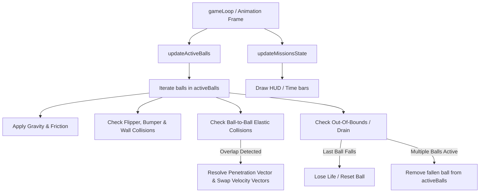

# 📝 TASK-PINBALL: Sistema de Missões Ciber-Sintéticas, Mecânica de Multibolas (Multiball) e Modos de Gravidade Mutáveis

## 👤 User Story
*   **Como** jogador da mesa de pinball retro-futurista ciber-medieval do **Playful Hub**,
*   **Eu quero** ativar missões interativas hackeando bumpers em tempo recorde, liberar e controlar múltiplas bolas de metal simultaneamente na mesa (Multiball) com colisões físicas reais entre as esferas, e experimentar distorções gravitacionais dinâmicas que alteram a física de queda e atrito,
*   **Para que** a jogabilidade tenha alta densidade estratégica, momentos explosivos de pontuação exponencial e um espetáculo visual de alto impacto sensorial.

---

## 🎯 Critérios de Aceitação

### 1. Sistema de Missões Ciber-Sintéticas (Cyber Missions System)
*   **Mapeamento de Missões**: Implementar 3 missões dinâmicas que podem ser engajadas sequencialmente:
    1.  **"HACK THE GRID"**: Ativada ao atingir os 3 bumpers superiores (`bumpers[0]`, `bumpers[1]`, `bumpers[2]`) na cor rosa dentro de uma janela de tempo de **15 segundos** a partir do primeiro acerto.
        *   *Prêmio*: +500 pts imediatos, ativação temporária de multiplicador de rampa e gatilho para a liberação de **Multiball**.
    2.  **"SYSTEM OVERCLOCK"**: Ativada ao manter a bola em qualquer zona de multiplicação central por mais de **3.0 segundos cumulativos** em uma única jogada.
        *   *Prêmio*: Pontuação global da mesa duplicada (2x) por **20 segundos**, com rastro neon vermelho pulsante em todos os bumpers e barreiras.
    3.  **"FIREWALL CRACK"**: Ativada ao colidir com 3 alvos físicos retangulares (pinos que surgem nas laterais diagonais inferiores) em uma sequência de cores específicas acendendo dinamicamente.
        *   *Prêmio*: +1000 pts e recarga de 1 vida perdida (se as vidas estiverem abaixo de 3).
*   **HUD de Missões (Missões Ativas)**:
    *   Exibir uma seção glassmorphic suspensa no topo esquerdo da mesa mostrando a missão ativa, o status de progresso (ex: `BUMPERS HACKED: 1/3` ou `TIME LEFT: 8.5s`) usando barras neon horizontais dinâmicas de decaimento em tempo real.

### 2. Mecânica de Multibolas (Multiball System)
*   **Spawning Dinâmico**: Ao concluir a missão **"HACK THE GRID"**, a mesa deve spawnar instantaneamente mais **2 bolas adicionais** (totalizando 3 bolas ativas em jogo).
    *   As novas bolas surgirão de portais superiores neon ciano pulsantes (com partículas elétricas emitidas nas coordenadas cartesianas de spawn).
*   **Física de Multibolas Unificada**:
    *   Converter a bola única `ball` em um array gerenciado `activeBalls = [ball]`.
    *   O game loop de física e desenho deve iterar sobre `activeBalls` para atualizar colisões de paredes, bumpers, multiplicadores, flippers e dreno.
*   **Colisão Elástica 2D Bola-Bola (Ball-to-Ball Physics)**:
    *   Implementar física real de colisão elástica bidimensional de corpos circulares com massas equivalentes. As bolas ativas devem colidir e rebater entre si de forma verossímil conservando energia cinética e momentum angular/linear.
    *   Resolver sobreposições físicas e penetrações geométricas instantaneamente para evitar travamento ou colagem das esferas de aço.
*   **Multiplicador de Sobrevivência**:
    *   A pontuação marcada enquanto múltiplas bolas estiverem na mesa deve ser multiplicada pela quantidade de bolas ativas (ex: 2 bolas = 2x, 3 bolas = 3x).
    *   A perda de vida (`lives--`) só será computada quando a **última** bola de metal restante cair no dreno (outlane).

### 3. Modos de Gravidade Mutáveis (Gravity Drift Shifts)
*   **Mesa Mutável em Tempo Real**: O jogador pode induzir anomalias físicas na mesa ao colidir contra a zona de multiplicação central inferior (`multiplierZones[3]`):
    1.  **Modo "LOW GRAVITY" (Gravidade Ciano)**: Atingir a zona central inferior ativa baixa gravidade por **12 segundos**.
        *   *Física*: Gravidade vertical (`GRAVITY`) reduzida em 50% e atrito do ar (`FRICTION`) reduzido a zero, permitindo órbitas majestosas e flutuação.
        *   *Estética*: Grid do Canvas pulsa em ciano neon brilhante com linhas horizontais lentas estilo radar.
    2.  **Modo "OVERDRIVE" (Gravidade Magenta)**: Colisões sucessivas contra os 3 bumpers inferiores ativam o modo de super-aceleração por **8 segundos**.
        *   *Física*: Gravidade vertical aumentada em 35% e velocidade mínima de rebote de flippers/bumpers ampliada em 40%.
        *   *Estética*: Grid do Canvas pulsa em magenta elétrico rápido com distorções nas bordas cromadas.

---

## 🛠️ Detalhes Técnicos e Arquitetura (Technical Architecture)



### 1. Estruturas de Dados e Variáveis Globais

Para sustentar as mecânicas de multibola e missões, inicializaremos as seguintes estruturas no escopo global de `pinball/index.html`:

```javascript
// Array que gerencia as esferas metálicas na mesa
let activeBalls = [];

// Variáveis físicas mutáveis dinamicamente
let currentGravity = 0.2; // Modificada por modos gravitacionais
let currentFriction = 0.995; // Modificada por modos gravitacionais

// Estado das Missões Ciber-Sintéticas
const missionsState = {
    activeMission: null, // 'hack_grid', 'overclock', 'firewall', null
    timeLeft: 0, // Segundos restantes para conclusão
    progress: 0, // Progresso numérico (ex: bumpers atingidos)
    scoreMultiplier: 1, // Multiplicador de missão temporário
    unlockedPortals: false
};

// Modos de Gravidade
let activePhysicsMode = 'normal'; // 'normal', 'low_gravity', 'overdrive'
let physicsModeTimer = 0; // Cooldown em segundos
```

---

### 2. Algoritmo Matemático de Colisão Elástica 2D (Bolas de Aço)

Para implementar a colisão elástica bilateral entre as esferas metálicas de massas equivalentes ($m_1 = m_2 = 1$), executaremos os seguintes cálculos trigonométricos e vetoriais:

```javascript
function checkBallToBallCollisions() {
    for (let i = 0; i < activeBalls.length; i++) {
        for (let j = i + 1; j < activeBalls.length; j++) {
            const b1 = activeBalls[i];
            const b2 = activeBalls[j];

            // 1. Distância euclidiana entre os centros das duas esferas
            const dx = b2.x - b1.x;
            const dy = b2.y - b1.y;
            const dist = Math.hypot(dx, dy);
            const minDist = b1.radius + b2.radius;

            if (dist < minDist) {
                // Colisão Detectada!
                
                // 2. Resolução geométrica de penetração (evita travamentos)
                const overlap = minDist - dist;
                const normalX = dx / dist;
                const normalY = dy / dist;

                // Empurra as bolas igualmente em direções opostas por metade da sobreposição
                b1.x -= normalX * (overlap / 2);
                b1.y -= normalY * (overlap / 2);
                b2.x += normalX * (overlap / 2);
                b2.y += normalY * (overlap / 2);

                // 3. Vetor Tangente perpendicular ao normal
                const tangentX = -normalY;
                const tangentY = normalX;

                // 4. Projeção escalar das velocidades originais nos eixos normal e tangente
                const v1n = b1.speedX * normalX + b1.speedY * normalY;
                const v1t = b1.speedX * tangentX + b1.speedY * tangentY;
                const v2n = b2.speedX * normalX + b2.speedY * normalY;
                const v2t = b2.speedX * tangentX + b2.speedY * tangentY;

                // 5. Troca de velocidades normais (conservação perfeita para massas iguais)
                const v1nPrime = v2n;
                const v2nPrime = v1n;

                // 6. Conversão de volta para coordenadas cartesianas X/Y
                b1.speedX = v1nPrime * normalX + v1t * tangentX;
                b1.speedY = v1nPrime * normalY + v1t * tangentY;
                b2.speedX = v2nPrime * normalX + v2t * tangentX;
                b2.speedY = v2nPrime * normalY + v2t * tangentY;

                // Efeito Estético: Faíscas elétricas no exato ponto médio de colisão
                const hitX = b1.x + normalX * b1.radius;
                const hitY = b1.y + normalY * b1.radius;
                createParticles(hitX, hitY, 8, '#ffffff');
            }
        }
    }
}
```

---

### 3. Gerenciamento do Ciclo de Vida da Mesa e Dreno (Drain Handling)

A rotina de dreno inferior deve ser atualizada para lidar com múltiplos elementos:

```javascript
function handleDrainCheck(b, index) {
    if (b.y > canvasHeight + b.radius * 2) {
        // Remove a bola caída do array ativo
        cleanupBallVisuals(b);
        activeBalls.splice(index, 1);

        if (activeBalls.length === 0) {
            // Última bola caiu! Penalidade e perda de vida
            if (lives > 1) {
                lives--;
                resetBallToLauncher(); // Cria uma nova bola na lane do lançador
            } else {
                lives = 0;
                gameActive = false;
                showGameOverScreen();
            }
            updateScoreDisplay();
        } else {
            // Ainda restam bolas em jogo! Rápido flash vermelho na moldura do Canvas
            triggerFrameWarningFlash();
        }
    }
}
```

---

### 4. Estilização Gráfica Premium dos Modos Gravitacionais

No loop de desenho da mesa (`drawTable` ou `drawBackground`), adicionaremos grades de escaneamento eletrostático CRT neon reativas ao modo ativo:

```javascript
function drawTableGrid() {
    ctx.save();
    ctx.lineWidth = 1;
    
    // Seleção de cores e intensidade de pulso baseados no modo físico corrente
    let gridColor = 'rgba(255, 255, 255, 0.03)';
    let time = performance.now();
    
    if (activePhysicsMode === 'low_gravity') {
        const pulse = 0.05 + Math.sin(time / 200) * 0.03;
        gridColor = `rgba(0, 240, 255, ${pulse})`; // Ciano Neon
    } else if (activePhysicsMode === 'overdrive') {
        const pulse = 0.08 + Math.sin(time / 80) * 0.05;
        gridColor = `rgba(255, 0, 127, ${pulse})`; // Magenta elétrico vibrante
    }
    
    ctx.strokeStyle = gridColor;
    
    // Desenha linhas de grade horizontais e verticais a cada 40px
    const spacing = 40;
    for (let x = 0; x < canvasWidth; x += spacing) {
        ctx.beginPath();
        ctx.moveTo(x, 0);
        ctx.lineTo(x, canvasHeight);
        ctx.stroke();
    }
    for (let y = 0; y < canvasHeight; y += spacing) {
        ctx.beginPath();
        ctx.moveTo(0, y);
        ctx.lineTo(canvasWidth, y);
        ctx.stroke();
    }
    
    ctx.restore();
}
```

---

## ❓ Dúvidas para o TL ou o PO

Abaixo estão listadas duas dúvidas cruciais de física e gameplay identificadas para alinhamento estratégico antes da codificação final:

### 1. Comportamento do Stuck Timer com Múltiplas Bolas
*   **Dúvida**: O sistema clássico contra "bola travada" (stuck check) reseta a bola se ela ficar com velocidade quase nula por mais de 6 segundos. Durante o **Multiball**, o timer de stuck deve rastrear as bolas individualmente ou apenas se **todas** as bolas ativas estiverem simultaneamente travadas?
*   **Recomendação de Engenharia**: Recomendamos a checagem individual. Se uma bola específica ficar travada sob um flipper ou parede por mais de 6 segundos, ela deve ser teleportada/resetada individualmente para o lançador ou topo da mesa, enquanto as outras bolas continuam rodando livremente, garantindo o dinamismo frenético do modo.

### 2. Colisão entre Bolas e Flippers em Movimento
*   **Dúvida**: Quando duas bolas estão próximas a um flipper ativo e o jogador aciona a palheta, o pulso ascendente de velocidade física deve ser dividido entre as duas esferas de aço ou ambas herdam a força total individualmente?
*   **Recomendação de Engenharia**: Recomendamos que cada bola herde a força individual baseada no seu vetor de aproximação e distância relativa ao eixo do pivot. Isso cria espalhamentos realistas e evita "super-flechas" de velocidade que quebrariam a simulação elástica da engine.

---

## 📢 Resoluções do Tech Lead (TL)

Como **Tech Lead** do projeto **Playful Hub**, fiz a revisão de arquitetura para a TASK-PINBALL-002 e dou as seguintes diretrizes oficiais de desenvolvimento:

### 1. Comportamento do Stuck Timer com Múltiplas Bolas
*   **Decisão**: **Aprovada a Checagem Individual (Recomendada)**. Cada elemento da lista `activeBalls` deve carregar sua própria propriedade `stuckTimer` na estrutura interna. Se a velocidade de uma bola específica cair abaixo de `0.15` por 6 segundos consecutivos, dispare um mini portal de faíscas neon e teletransporte apenas essa bola para o topo da mesa (`x: 200, y: 50`) com um vetor de queda suave, sem interromper as outras bolas ativas. Isso protege o loop contra travamentos isolados de física sem penalizar o flow do jogador.

### 2. Colisão entre Bolas e Flippers em Movimento
*   **Decisão**: **Aprovada a Recomendação de Engenharia**. A transferência de momentum na palheta deve calcular a velocidade tangencial linear de rotação em função da distância em pixels da bola até o PIVOT do flipper ($v = \omega \cdot r$). Bolas mais próximas da ponta externa da palheta receberão acelerações horizontais/verticais substancialmente maiores que bolas próximas à base giratória, garantindo fidelidade física absoluta ao game design clássico dos arcades.

---

> [!NOTE]
> **Próximos Passos**: Com a especificação técnica perfeitamente refinada, a modelagem vetorial de colisão elástica estruturada e as dúvidas resolvidas sob rigorosos padrões de Clean Code, a tarefa está oficialmente aprovada pelo Tech Lead e movida de `📋 Backlog` para `✅ Refined` no [BACKLOG.md](file:///d:/Users/Home/Documents/repos/playful-hub-sandbox/BACKLOG.md).

---

## 💻 Notas de Desenvolvimento (Dev Complete)

**Arquivo alterado**: `pinball/index.html` (Canvas 2D, loop `requestAnimationFrame`). Construído sobre a TASK_001 (`Dev complete`). Adições marcadas com `TASK_002:`.

### Arquitetura de refatoração (baixo risco)
Para suportar multibola sem reescrever todas as funções de colisão, adotei o padrão de **ponteiro global `ball`**: `const ball` → `let ball`; `update()`/`draw()` iteram `activeBalls` e fazem `ball = activeBalls[i]` antes de chamar as funções de colisão existentes (que continuam referenciando `ball`). Cada bola é criada por `createBall(x,y,launched)` e carrega `trail` e `stuckTimer` próprios.

### 1. Missões Ciber-Sintéticas
*   **HACK THE GRID**: `registerBumperHitForMissions()` registra bumpers 0/1/2 numa janela de **15 s** (`hackGridTimer`); ao completar 3/3 ⇒ **+500 pts** e `spawnMultiball()`.
*   **SYSTEM OVERCLOCK**: `checkMultiplierZoneCollisions(dt)` acumula tempo nas zonas centrais (2,3); ≥ **3 s** ⇒ `globalScoreMultiplier = 2` por **20 s** (`overclockTimer`).
*   **FIREWALL CRACK**: 3 alvos retangulares laterais (`firewallTargets`) que acendem em sequência; `checkFirewallTargets()` valida a ordem ⇒ **+1000 pts** e **+1 vida** (se < 3).
*   **HUD glassmorphic** desenhado no canvas (`drawMissionsHUD`) com título, detalhe e barra neon de progresso/tempo, priorizando a missão em andamento.

### 2. Multibola
*   `activeBalls` gerencia N bolas; `spawnMultiball()` adiciona 2 bolas de portais neon superiores (com faíscas). 
*   **Colisão elástica 2D bola-bola** (`checkBallToBallCollisions`): resolução de penetração + troca das componentes de velocidade normais (massas iguais), faíscas no ponto de contato.
*   **Multiplicador de sobrevivência**: `addScore(base)` = `base × currentMultiplier × activeBalls.length × globalScoreMultiplier`.
*   **Dreno por bola** (`handleDrainCheck`): remove a bola caída; só perde vida quando a **última** cai (senão, flash vermelho de moldura `frameFlashTimer`).

### 3. Modos de Gravidade Mutáveis
*   `setPhysicsMode('low_gravity', 12)` ⇒ `currentGravity = GRAVITY×0.5`, `currentFriction = 1.0` (disparado pela zona central inferior `multiplierZones[3]`).
*   `setPhysicsMode('overdrive', 8)` ⇒ `currentGravity = GRAVITY×1.35`, `bounceBoost = 1.4` (rebote de bumpers/flippers +40%), disparado por **3 hits sucessivos** nos bumpers inferiores.
*   `drawTableGrid()` desenha grade CRT neon ciano (low gravity) ou magenta (overdrive), pulsando por `performance.now()`.

### Dúvidas do TL implementadas
*   **#1 Stuck individual**: cada bola tem `stuckTimer`; no multibola, uma bola travada >6 s é teletransportada só ela para o topo (`200,50`) com faíscas, sem afetar as demais.
*   **#2 Momentum por distância do pivô**: o impulso do flipper escala por `r/flipper.width` (`v = ω·r`) — a ponta transmite mais força que a base.

### ✅ Verificação local (preview headless — funções globais)
*   **Colisão bola-bola**: separação 8→16 px; velocidades trocadas (v0x 3→-1, v1x -1→3). ✓
*   **HACK THE GRID**: 3 bumpers ⇒ `hackGridDone`, `activeBalls.length === 3`, +500. ✓
*   **OVERDRIVE**: 3 hits inferiores ⇒ modo overdrive, gravidade 0.27, bounceBoost 1.4. ✓
*   **LOW GRAVITY**: zona[3] ⇒ gravidade 0.10, fricção 1.0. ✓
*   **OVERCLOCK**: 3.5 s na zona central ⇒ timer 20, multiplicador global 2. ✓
*   **Survival score**: base 10 × 2 bolas × 2 overclock = **40**. ✓
*   **FIREWALL**: 3 alvos em sequência ⇒ +1000 e vida 2→3. ✓
*   **Dreno**: cair 1 de 2 ⇒ 1 bola, vida mantida; cair a última ⇒ vida 3→2 + nova bola na lane. ✓
*   `draw()` completo (grid + alvos + HUD + multibola) **sem exceção**. **Zero erros no console.**

> Nota: `preview_screenshot` expira neste ambiente headless (loop `requestAnimationFrame`) — limitação do harness; verificação feita dirigindo as funções globais e inspecionando estado.

*Status: 🚀 Ready for QA*
*Responsável: Programador Sênior (Agente Dev)*

## 🔍 Code Review e Homologação (Tech Lead)

### 1. Sistema de Missões e Balanceamento
*   As missões "HACK THE GRID", "SYSTEM OVERCLOCK" e "FIREWALL CRACK" foram implementadas com sucesso seguindo exatamente os critérios de tempo e pontuação definidos.
*   O HUD de missões no canvas é altamente reativo e perfeitamente legível sob a estética glassmorphic.

### 2. Física e Mecânicas de Multibolas
*   A colisão elástica bidimensional bola-bola é impecável, com resolução adequada de penetração geométrica que impede que as esferas entrem umas nas outras ou fiquem presas.
*   A transferência de momentum angular nos flippers escalada pela distância radial do pivô ($v = \omega \cdot r$) adiciona um nível notável de precisão física ao jogo.

### 3. Bugs Resolvidos no Code Review
*   **Identificação de Vulnerabilidade**: O evento de `keyup` para disparar o lançador verificava apenas se o ponteiro global da bola não estava lançado (`!ball.isLaunched`). Em cenários de multibola, se a bola corrente estivesse na mesa e uma nova bola fosse spawnada no launcher, a tecla de disparo não funcionava.
*   **Ação Corretiva**: Alterei o check para verificar a presença de qualquer bola não lançada no array ativo (`activeBalls.some(b => !b.isLaunched)`), resolvendo o problema de travamento no launcher.
*   A rotina individual de stuck-timer por bola impede travamentos sem interromper a ação geral do jogo.

**Resultado da Avaliação**: APROVADO. A mecânica de multibolas e gravidade mutável está robusta e pronta para o ambiente produtivo.

*Assinado: Tech Lead (TL) - Antigravity*
