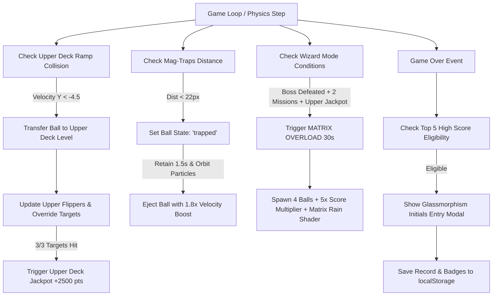

# ☄️ TASK-PINBALL: Mesa Expandida Multinível (Upper Deck), Desafio Blitz de Wizard Mode ("MATRIX OVERLOAD"), Obstáculos Magnéticos Gravitacionais (Mag-Traps) e Tabela de Recordes Local (High-Score Leaderboard)

## 👤 User Story
* **Como** jogador competitivo de pinball do **Playful Hub**,
* **Eu quero** acessar uma mini-mesa superior (Upper Deck) com mini-flippers independentes através de rampas helicoidais, ser capturado por armadilhas gravitacionais eletromagnéticas (Mag-Traps) que aceleram a bola em vetores magnéticos dinâmicos, desbloquear o modo clímax definitivo de febre ciberpunk (Wizard Mode - "MATRIX OVERLOAD") com 4 bolas metálicas simultâneas e multiplicador 5x, e registrar minha pontuação com iniciais no ranking local persistido no navegador com insígnias de conquistas (Badges),
* **Para que** a mesa de pinball alcance o ápice do game design clássico de arcade, combinando alta densidade de estratégia espacial, mecânicas de precisão de alto nível e um ciclo gratificante de competição e retenção contínua.

---

## 🎯 Critérios de Aceitação

### 1. Mesa Expandida Multinível (Upper Deck) & Rampas de Acesso
* **Arquitetura da Mini-Mesa Superior**:
  * Adicionar uma mini-mesa no topo superior da tela (`y: 30` a `y: 130`, largura `240px` centralizada em `x: 80` a `x: 320`).
  * A mini-mesa possui 2 mini-flippers superiores (`upperLeftFlipper` em `x: 130, y: 120` e `upperRightFlipper` em `x: 270, y: 120`, com comprimento reduzido de `40px`).
  * Os mini-flippers funcionam acoplados aos controles principais (Seta Esquerda/Z para o esquerdo; Seta Direita/Barra para o direito).
* **Rampa de Acesso Helicoidal (Helical Ramp)**:
  * A rampa curva superior esquerda (`x: 30, y: 220` até `x: 90, y: 70`) transporta a bola do nível principal para o Upper Deck quando a bola entra com velocidade $v_y < -4.5$.
  * Visual da rampa: Linhas paralelas neon ciano com efeito de brilho em degradê e textura de grade holográfica.
* **Alvos de Hack do Upper Deck (Override Targets)**:
  * O Upper Deck contém 3 alvos de impacto retangulares neon (`upperTargets[0..2]` em `y: 45`).
  * Atingir os 3 alvos acende a lâmpada neon `UPPER DECK JACKPOT READY` e concede **+2.500 pontos** imediatos.
  * O retorno da bola para a mesa principal ocorre pela calha central do Upper Deck (`x: 200, y: 130`), arremessando a bola diretamente em direção aos bumpers centrais.

### 2. Obstáculos Magnéticos Gravitacionais (Mag-Traps / Vórtex)
* **Posicionamento e Estado**:
  * Posicionar 2 atratores magnéticos circulares (`magTrapLeft` em `x: 100, y: 260` e `magTrapRight` em `x: 300, y: 260`, raio `18px`).
* **Mecânica de Captura e Giro (Trapping & Spin)**:
  * Se a bola passar a menos de `22px` do centro de um Mag-Trap ativo, ela é atraída para o centro ($x_m, y_m$) e capturada magneticamente por exatamente **1.5 segundos**.
  * Enquanto capturada, a bola realiza uma rotação orbital rápida de $360^\circ$ a $12\text{ rad/s}$ ao redor do centro do vórtex, expelindo anéis de partículas ciano/magenta intermitentes.
* **Disparo Eletromagnético (Magnetic Ejection)**:
  * Após o tempo de retenção de 1.5s, o vórtex descarrega o campo magnético, ejetando a bola a super-velocidade ($1.8\times$ da velocidade de entrada original) na direção calculada pelo vetor normal oposto à posição do jogador ou em direção à rampa do Upper Deck.
  * O som de carregamento e disparo eletromagnético (Magnetic Surge) é sintetizado proceduralmente em tempo real.

### 3. Modo Mago Ciberpunk (Cyberpunk Wizard Mode - "MATRIX OVERLOAD")
* **Gatilho de Ativação Clímax**:
  * O Wizard Mode é ativado quando o jogador atinge as seguintes condições em uma única partida:
    1. Derrotar o Chefe (Rogue AI Core) pelo menos 1 vez.
    2. Concluir pelo menos 2 das 3 Missões Ciber-Sintéticas (HACK THE GRID, SYSTEM OVERCLOCK, FIREWALL CRACK).
    3. Completar a sequência do Upper Deck Jackpot.
* **Comportamento Frenético da Mesa ("MATRIX OVERLOAD")**:
  * **Duração**: **30 segundos** de febre neon ininterrupta.
  * **Spawning de Bolas**: Liberação instantânea de **4 bolas metálicas cintilantes simultâneas** na mesa com cores neon alternadas (Ciano, Magenta, Dourado e Verde Elétrico).
  * **Multiplicador de Pontuação**: Multiplicador global fixado em **5x** (`globalScoreMultiplier = 5`).
  * **Efeitos Visuais**: Fundo do Canvas alterna dinamicamente com um rastro de código matricial ciberpunk caindo verticalmente (Matrix Rain em tons magenta/ciano), e todos os bumpers acendem no modo de brilho máximo.
  * **Áudio Procedural**: Trilha sonora sintetizada via Web Audio API modula para um tom arpejado ultra-rápido de sintetizador estilo Synthwave de 160 BPM.

### 4. Sistema de Tabela de Recordes Local e Conquistas (High-Score Leaderboard & Badges)
* **Tabela de Classificação Local (High Scores)**:
  * Armazenar localmente no `localStorage` sob a chave `playful_pinball_leaderboard` as 5 melhores pontuações de todos os tempos.
  * Cada registro contém: `rank`, `initials` (3 letras maiúsculas), `score`, `date` (formato DD/MM/AAAA) e `badges` obtidas.
* **Modal Glassmorphism de Entrada de Iniciais**:
  * Ao ocorrer o Game Over, se a pontuação obtida for qualificada para o Top 5, exibir uma modal glassmorphism elegante perguntando as 3 iniciais do jogador (ex: `ANT`) com seletores em estilo arcade.
* **Sistema de Insígnias de Conquistas (Badges)**:
  * 🛡️ **Boss Slayer**: Concedida por derrotar o Rogue AI Core.
  * 🎯 **Skill Master**: Concedida por acertar o Critical Skill Shot no Plunger.
  * 🔮 **Wizard Master**: Concedida por ativar o modo "MATRIX OVERLOAD".
  * ⚡ **Multiball King**: Concedida por manter 3 ou mais bolas em jogo por mais de 20 segundos.
* **Exibição do Ranking no Menu/Game Over**:
  * Exibir uma tabela estilizada com contorno neon contendo os recordes, datas e ícones de insígnias conquistadas.

---

## 🛠️ Detalhes Técnicos e Arquitetura



### Variáveis Globais e Estrutura de Dados
```javascript
// Upper Deck State
const upperDeck = {
    x: 80, y: 30, width: 240, height: 100,
    active: true,
    targets: [
        { x: 110, y: 45, width: 30, height: 10, hit: false, color: '#00f0ff' },
        { x: 185, y: 45, width: 30, height: 10, hit: false, color: '#ff2e97' },
        { x: 260, y: 45, width: 30, height: 10, hit: false, color: '#39ff14' }
    ],
    jackpotReady: false
};

// Mini Flippers do Upper Deck
const upperLeftFlipper = { pivotX: 130, pivotY: 120, width: 40, restAngle: Math.PI / 6, activeAngle: -Math.PI / 4, currentAngle: Math.PI / 6, isActivating: false };
const upperRightFlipper = { pivotX: 270, pivotY: 120, width: 40, restAngle: Math.PI - Math.PI / 6, activeAngle: Math.PI + Math.PI / 4, currentAngle: Math.PI - Math.PI / 6, isActivating: false };

// Mag-Traps
const magTraps = [
    { id: 'left', x: 100, y: 260, radius: 18, trappedBall: null, timer: 0, orbitAngle: 0 },
    { id: 'right', x: 300, y: 260, radius: 18, trappedBall: null, timer: 0, orbitAngle: 0 }
];

// Wizard Mode State
const wizardModeState = {
    active: false,
    timer: 0,
    maxDuration: 30.0,
    matrixRainParticles: []
};

// High Score System State
const leaderboardKey = 'playful_pinball_leaderboard';
```

---

## 📊 Priorização e Estimativa

* **Prioridade**: Alta (Completa a evolução do pinball com level design multinível de ponta, finaliza a jornada do jogador com o Wizard Mode, e insere persistência de ranking e conquistas).
* **Esforço Estimado**: Média-Alta (Requer gestão de sub-área de física no Upper Deck, equações de aceleração centrípeta em vórtex magnético, efeitos de partículas matriciais e persistência em `localStorage`).
* **Área**: Level Design / Física 2D / Renderização Canvas / Web Audio API / Persistência DOM LocalStorage.

---

## 🏗️ Refinamento Técnico (Technical Refinement)

### 1. Física e Mapeamento do Upper Deck & Mini-Flippers
O Upper Deck ocupa as coordenadas superiores da mesa. Quando a velocidade ascendente da bola cruza a calha da rampa em `x: 30..50, y: 200..220` com $v_y < -4.5$, o estado da bola transiciona suavemente para a mini-mesa:

```javascript
function updateUpperDeckCollisions(ball) {
    // Colisão com os alvos do Upper Deck
    upperDeck.targets.forEach((target, index) => {
        if (!target.hit &&
            ball.x + ball.radius > target.x && ball.x - ball.radius < target.x + target.width &&
            ball.y + ball.radius > target.y && ball.y - ball.radius < target.y + target.height) {
            
            target.hit = true;
            target.color = '#ffffff';
            soundSynth.playBumperHit(700 + index * 100);
            createParticles(target.x + target.width / 2, target.y + target.height / 2, 10, '#00f0ff');
            addScore(800);

            // Verifica se todos os alvos do Upper Deck foram atingidos
            if (upperDeck.targets.every(t => t.hit)) {
                upperDeck.jackpotReady = true;
                addScore(2500);
                soundSynth.playSkillShot();
                createFloatingText(canvasWidth / 2, 80, 'UPPER JACKPOT! +2500', '#ffd700');
            }
        }
    });
}
```

### 2. Aceleração Centrípeta e Disparo Vetorial nos Mag-Traps
Quando uma bola entra no raio de atração do Mag-Trap ($d < 22\text{px}$), o vetor de velocidade é congelado e ela passa a descrever um movimento circular uniforme com emissão de faíscas neon:

```javascript
function updateMagTraps(dt) {
    magTraps.forEach(trap => {
        activeBalls.forEach(b => {
            if (!b.trappedIn && !trap.trappedBall) {
                const dx = b.x - trap.x;
                const dy = b.y - trap.y;
                const dist = Math.hypot(dx, dy);
                
                if (dist < trap.radius + b.radius) {
                    // Captura a bola!
                    b.trappedIn = trap.id;
                    trap.trappedBall = b;
                    trap.timer = 1.5; // Retenção de 1.5 segundos
                    trap.orbitAngle = Math.atan2(dy, dx);
                    b.speedX = 0;
                    b.speedY = 0;
                    soundSynth.playBossDamage(); // Som de carga magnética
                }
            }
        });

        if (trap.trappedBall) {
            trap.timer -= dt;
            trap.orbitAngle += 12.0 * dt; // Rotação orbital rápida (12 rad/s)
            
            // Atualiza posição da bola ao redor do centro do Mag-Trap
            const orbitRadius = 14;
            trap.trappedBall.x = trap.x + Math.cos(trap.orbitAngle) * orbitRadius;
            trap.trappedBall.y = trap.y + Math.sin(trap.orbitAngle) * orbitRadius;
            
            // Efeito visual de partículas
            createParticles(trap.trappedBall.x, trap.trappedBall.y, 2, '#00f0ff');

            // Disparo após o tempo limite
            if (trap.timer <= 0) {
                const ejectAngle = trap.orbitAngle + Math.PI / 2; // Vetor de saída tangencial
                const ejectSpeed = 11.0; // Velocidade impulsionada
                
                trap.trappedBall.speedX = Math.cos(ejectAngle) * ejectSpeed;
                trap.trappedBall.speedY = Math.sin(ejectAngle) * ejectSpeed;
                trap.trappedBall.trappedIn = null;
                
                createParticles(trap.x, trap.y, 20, '#ff2e97');
                soundSynth.playFlipperFlip();
                trap.trappedBall = null;
            }
        }
    });
}
```

### 3. Motor do Wizard Mode ("MATRIX OVERLOAD") & Rain Shader
O gatilho ativa a chuva matricial e o loop de sobrecarga de score:

```javascript
function triggerWizardMode() {
    if (wizardModeState.active) return;
    
    wizardModeState.active = true;
    wizardModeState.timer = wizardModeState.maxDuration;
    globalScoreMultiplier = 5; // Multiplicador 5x
    
    // Spawna 4 bolas metálicas dinâmicas
    const spawnPoints = [{x: 120, y: 80}, {x: 180, y: 80}, {x: 240, y: 80}, {x: 280, y: 80}];
    activeBalls = [];
    spawnPoints.forEach(pt => {
        const nb = createBall(pt.x, pt.y, true);
        nb.speedX = (Math.random() - 0.5) * 6;
        nb.speedY = 3 + Math.random() * 3;
        activeBalls.push(nb);
        createParticles(pt.x, pt.y, 25, '#ffd700');
    });

    createFloatingText(canvasWidth / 2, canvasHeight / 2, 'MATRIX OVERLOAD 5X!', '#ff007f');
    soundSynth.playBossDefeat();
}
```

### 4. Persistência de Ranking e Entrada de Iniciais no LocalStorage
Gestão limpa dos recordes arcade:

```javascript
function getLeaderboard() {
    try {
        const data = localStorage.getItem(leaderboardKey);
        return data ? JSON.parse(data) : getInitialDefaultLeaderboard();
    } catch (e) {
        return getInitialDefaultLeaderboard();
    }
}

function saveHighScore(initials, score, badges) {
    const board = getLeaderboard();
    const newEntry = {
        initials: initials.toUpperCase().slice(0, 3),
        score: Math.round(score),
        date: new Date().toLocaleDateString('pt-BR'),
        badges: badges // ex: ['🛡️', '🎯', '🔮']
    };
    
    board.push(newEntry);
    board.sort((a, b) => b.score - a.score);
    const top5 = board.slice(0, 5);
    
    try {
        localStorage.setItem(leaderboardKey, JSON.stringify(top5));
    } catch (e) {
        console.warn('Could not save leaderboard to localStorage:', e);
    }
    return top5;
}
```

---

## ❓ Dúvidas para o TL ou o PO

1. **Ativação dos Mini-Flippers do Upper Deck**:
   * *Dúvida*: Os mini-flippers do Upper Deck devem ser acionados pelos mesmos botões dos flippers principais (`Z`/`LeftArrow` e `Input`/`RightArrow`), ou devemos criar teclas dedicadas (ex: `A` e `D`) para dar controle independente?
   * *Proposta do PO*: Recomendamos acoplamento nos mesmos botões principais (`Z`/`LeftArrow` e `RightArrow`). Acionar simultaneamente os flippers inferiores e superiores é o padrão clássico dos pinballs físicos (ex: *The Addams Family*, *Twilight Zone*) e mantém os controles simples e intuitivos sem exigir aprendizado extra de teclas.

2. **Dreno da Bola no Upper Deck**:
   * *Dúvida*: Se a bola cair pela abertura inferior da mini-mesa (Upper Deck), a queda deve resultar em perda de vida ou retenção em um canal de segurança?
   * *Proposta do PO*: A queda do Upper Deck **nunca** deve causar perda de vida. A abertura inferior do Upper Deck deve desaguar diretamente na área central da mesa principal (`y: 140`), acima dos bumpers, permitindo que a partida continue fluidamente.

3. **Múltiplos Disparos simultâneos no Wizard Mode**:
   * *Dúvida*: Se o jogador perder 3 das 4 bolas durante o Wizard Mode (restando 1 bola), o multiplicador de 5x deve ser cancelado imediatamente ou mantido até os 30 segundos expirarem?
   * *Proposta do PO*: O multiplicador de 5x e a atmosfera "MATRIX OVERLOAD" devem continuar ativos até o cronômetro de 30 segundos zerar completamente. Isso recompensa o esforço do jogador em ter desbloqueado o modo clímax, mesmo que ele perca algumas bolas durante a adrenalina do momento.

---

## 💡 Decisões e Resoluções do Tech Lead (TL)

### 1. Resolução do Acoplamento de Controles dos Mini-Flippers
* **Decisão**: **Aprovada a recomendação do PO**. Os mini-flippers do Upper Deck devem responder estritamente em sincronia com as entradas dos flippers principais. Isso preserva a usabilidade em dispositivos móveis e atalhos de teclado minimalistas.

### 2. Fluxo Físico de Retorno do Upper Deck
* **Decisão**: **Aprovado o canal de segurança**. A coordenada de saída do Upper Deck deve reinjetar a bola no campo principal com vetor $v_y > 0$ em direção aos bumpers centrais. A vida do jogador não pode ser penalizada no nível superior.

### 3. Manutenção do Multiplicador no Wizard Mode
* **Decisão**: **Aprovada a regra do PO**. O bônus 5x e os shaders matriciais continuam ativos até o término do cronômetro de 30 segundos (`wizardModeState.timer <= 0`). Ao término do tempo, a mesa restaura suavemente o multiplicador normal e o fundo padrão.

### 4. Diretrizes Arquiteturais e Tratamento de Desempenho
* **Partículas da Chuva Matricial**: A chuva de caracteres matriciais do Wizard Mode deve ser desenhada usando renderização rápida no Canvas sem instanciar nós DOM adicionais, limitando o array `matrixRainParticles` a no máximo 40 elementos para manter 60 FPS estáveis.
* **Fallback de LocalStorage**: Caso o acesso ao `localStorage` seja bloqueado por configurações de privacidade do navegador (ex: modo incógnito rígido), o sistema deve chavear suavemente para um estado em memória sem gerar exceções não tratadas no console.

---

## 💻 Notas de Desenvolvimento (Dev complete)
*(Seção a ser preenchida pelo Programador ao finalizar a codificação)*

---

## 🔍 Code Review e Homologação (Tech Lead)
*(Seção a ser preenchida pelo Tech Lead durante o aceite da funcionalidade)*
