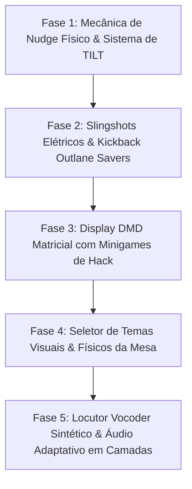

# 🎱 TASK_005: Mecânica de Empurrão Físico (Table Nudge & Tilt), Slingshots Elétricos com Kickback Outlane Savers, Display DMD com Minigames de Hack e Locutor Vocoder Synthwave

## 👤 User Story
* **Como** jogador apaixonado por pinball clássico e competitivo no **Playful Hub**,
* **Eu quero** aplicar empurrões táticos na mesa (Table Nudge) com gerenciador de advertências de TILT, acionar defesas automáticas de pistão (Kickback Savers) nos canais laterais externos (outlanes), rebater nos triângulos elétricos (Slingshots) acima das aletas, jogar micro-desafios interativos no display retro matricial (Dot-Matrix Display - DMD) e ouvir um narrador holográfico com voz de vocoder sintetizada e trilha adaptativa,
* **Para que** a experiência de pinball atinja o estado da arte de um simulador mecânico e digital profissional, proporcionando profundidade tática, momentos de resgate heroico da bola e imersão audiovisual inigualável.

---

## 🗺️ Plano de Implementação Dividido em Fases



---

## 🎯 Especificação Detalhada por Fases & Critérios de Aceitação

### 🔹 Fase 1: Mecânica de Empurrão Tático da Mesa (Table Nudge & Sistema de TILT)
1. **Controles e Dinâmica de Empurrão (Nudge)**:
   - **Mapeamento de Teclas**: Teclas `Q` ou `Seta para Cima` (empurrão central), `Shift Esquerdo` / `A` com tecla modificadora (empurrão para a direita) e `Shift Direito` / `D` com tecla modificadora (empurrão para a esquerda), além de gesto de *swipe/arraste* rápido no suporte tátil mobile.
   - **Vetor de Força & Inércia**:
     - Cada empurrão aplica um deslocamento físico sutil na mesa de `2.5px` a `4.0px` no sentido do empurrão com amortecimento por mola (*spring damping* com oscilação senoidal de 0.25s).
     - A bola recebe um impulso inercial vetorial proporcional: $\Delta v_x = \pm 1.8\text{ px/step}$ e $\Delta v_y = -1.2\text{ px/step}$.
2. **Sistema de Advertência e Penalidade de TILT**:
   - **Medidor de Estresse (Tilt Meter)**:
     - Cada nudge adiciona `35 pontos` a uma barra de estresse que decai a `-15 pts/segundo`.
     - 1º Estresse Crítico ($\ge 60\text{ pts}$): Alerta sonoro de advertência com texto neon pulsante `"WARNING 1"`.
     - 2º Estresse Crítico ($\ge 85\text{ pts}$): Alerta sonoro duplo com texto `"WARNING 2"`.
     - 3º Estresse Crítico ($\ge 100\text{ pts}$): **"TILT!"**.
   - **Comportamento no TILT**:
     - As aletas (flippers), bumpers e slingshots são desenergizados e desativados imediatamente.
     - A mesa fica em modo blackout estático e a bola drena fatalmente sem concessão de pontuação adicional.

---

### 🔹 Fase 2: Slingshots Eletrizantes & Kickback Outlane Savers
1. **Triângulos de Slingshots Ativos**:
   - **Posicionamento**: Dois triângulos elásticos posicionados diretamente acima dos pivôs dos flippers:
     - `leftSlingshot`: Triângulo com vértices em `(55, 470)`, `(90, 515)` e `(55, 515)`.
     - `rightSlingshot`: Triângulo com vértices em `(310, 470)`, `(275, 515)` e `(310, 515)`.
   - **Física de Rebatida & Impulso Estroboscópico**:
     - Ao tocar na face inclinada, um sensor elástico dispara a bola perpendicularmente com impulso vigoroso ($v_r = 7.5\text{ px/step}$) em direção ao centro da mesa.
     - Animação de feixe de faíscas neon e flash estroboscópico na cor tema do slingshot.
2. **Sistema de Kickback (Salva-Vidas nos Outlanes)**:
   - **Canais Externos (Outlanes Esquerdo e Direito)**:
     - Vão entre a guia da parede e o slingshot (`x: 10..45, y: 450..550` na esquerda; `x: 320..355, y: 450..550` na direita).
   - **Gatilho de Ativação do Kickback**:
     - Acertar alvos específicos de recarga (`Kickback Recharge Targets`) energiza a luz neon `KICKBACK READY`.
     - Se a bola cair no outlane com o Kickback ativo, um solenoide virtual dispara um pistão de alta velocidade na base do canal, arremessando a bola de volta ao topo da mesa com efeito sonoro de feixe de laser sônico.

---

### 🔹 Fase 3: Display DMD Matricial com Minigames de Hack (Dot-Matrix Display)
1. **Painel DMD Retrô Neon (Dot-Matrix Display de 128x32 pontos)**:
   - Renderização no topo do HUD de um display de matriz de pontos âmbar/magenta com estética retrô de pinball dos anos 90.
   - Exibição de pontuações rolantes, animações de jackpot, rostos do chefe IA e contadores de missões.
2. **Minigames Interativos no DMD**:
   - **Minigame 1: "CYBER LOCKPICK"**:
     - Ativado ao travar a bola na rampa central.
     - A bola fica retida magneticamente por 5 segundos enquanto o jogador usa os flippers esquerdo e direito para alinhar sequências de bits no display DMD.
     - Sucesso: Concede **+10.000 pontos** e libera **Super Multiplicador 5x**.
   - **Minigame 2: "FIREWALL RUNNER"**:
     - Um mini corredor de pixels no display DMD onde o jogador desvia de barreiras digitais pressionando as aletas no tempo certo.

---

### 🔹 Fase 4: Seletor de Temas Visuais & Físicos da Mesa
1. **Três Temas Cromáticos e Atmosféricos Completos**:
   - 🌆 **Synthwave 1984 (Padrão)**: Fundo escuro azul-petróleo com neon magenta (#ff2e97), ciano (#00f0ff) e grade retroiluminada.
   - 🌅 **Vaporwave Sunset**: Paleta quente em degradê pôr do sol (#ff7b00, #ff007f, #9400d3), física de gravidade ligeiramente mais leve (`0.14`) e trilha lofi relaxante.
   - 🧪 **Cyber Matrix Void**: Paleta verde fósforo (#39ff14) e preto obsidiana, código de matrix caindo em tempo real e bumpers com pulso bio-sintético.
2. **Interface de Troca em Tempo Real**:
   - Menu discreto com atalho rápido `T` ou botão estilizado no painel de controle superior.

---

### 🔹 Fase 5: Locutor Vocoder Sintético & Áudio Adaptativo em Camadas
1. **Cyber Announcer Synth (Voz Sintética Procedural)**:
   - Síntese de voz com modulação vocoder via Web Audio API e Web Speech Synthesis filtrada com distorção harmônica e reverb espacial:
     - *"LAUNCH INITIALIZED!"* (no disparo da bola).
     - *"COMBO MULTIPLIER ACTIVE!"* (em combos sucessivos de bumpers).
     - *"KICKBACK SAVED!"* (ao salvar a bola no outlane).
     - *"WARNING! EXCESSIVE FORCE DETECTED!"* (ao atingir o limiar de TILT).
     - *"JACKPOT OVERLOAD!"* (ao completar as missões centrais).
2. **Trilha Sonora Adaptativa em Camadas (Dynamic Layering)**:
   - A trilha synthwave se desenvolve dinamicamente:
     - Camada 1: Linha de baixo (Bassline) em ritmo regular (durante o jogo normal).
     - Camada 2: Sintetizador arpejado e bateria (ativado com multiplicadores $\ge 2x$).
     - Camada 3: Solo de sintetizador rápido e efeitos espaciais (durante Boss Fight e Multibolas).

---

## 📐 Estruturas de Dados Propostas

```javascript
// Estado do Sistema de Nudge e Tilt
const tiltSystem = {
    stressMeter: 0,        // 0 a 100
    warnings: 0,           // 0, 1, 2
    isTilted: false,
    decayRate: 15,         // decaimento de estresse por segundo
    tableOffset: { x: 0, y: 0 },
    springVelocity: { x: 0, y: 0 }
};

// Slingshots e Kickbacks
const slingshots = [
    { id: 'left',  p1: {x: 55, y: 470}, p2: {x: 90, y: 515}, p3: {x: 55, y: 515}, kickPower: 7.5, hitFlash: 0 },
    { id: 'right', p1: {x: 310, y: 470}, p2: {x: 275, y: 515}, p3: {x: 310, y: 515}, kickPower: 7.5, hitFlash: 0 }
];

const kickbackState = {
    leftActive: true,
    rightActive: false,
    cooldownTimer: 0,
    targetHitCount: 0
};

// Minigames do Display DMD
const dmdSystem = {
    activeMode: 'SCORE_DISPLAY', // 'SCORE_DISPLAY' | 'CYBER_LOCKPICK' | 'FIREWALL_RUNNER'
    matrixGrid: new Uint8Array(128 * 32),
    timer: 0,
    scoreBonus: 0
};
```

---

## 🧪 Plano de Testes Automatizados (QA)

1. **Teste de Nudge e Acúmulo de TILT (`tests/qa_pinball_nudge_tilt.test.js`)**:
   - Pressionar comandos de empurrão repetidos e validar advertências `WARNING 1`, `WARNING 2` e corte de controles no `TILT`.
2. **Teste de Rebatida dos Slingshots (`tests/qa_pinball_slingshots.test.js`)**:
   - Posicionar a bola na face do slingshot e validar impulso vetorial e animação de flash elétrico.
3. **Teste de Resgate por Kickback (`tests/qa_pinball_kickback.test.js`)**:
   - Deixar a bola cair no outlane esquerdo com Kickback ativado e confirmar que a bola é ejetada de volta para o topo da mesa sem perda de vida.
4. **Teste de Minigame DMD e Vocoder (`tests/qa_pinball_dmd_audio.test.js`)**:
   - Ativar o travamento na rampa central e validar execução dos micro-desafios e chamadas do narrador sintético sem erros de contexto Web Audio.

---

## 📋 Critérios de Aceitação de Conclusão (Definition of Done)
- [x] Mecânica de empurrão (Nudge) com resposta inercial da mesa e física da bola.
- [x] Sistema de 2 advertências com punição de TILT funcional.
- [x] Slingshots esquerdo e direito operando com rebatida precisa.
- [x] Kickback outlane saver salvando a bola dos canais externos.
- [x] Display DMD com renderização de matriz de pontos e minigame de hack.
- [x] Seletor de 3 temas cromáticos completos (Synthwave, Vaporwave, Cyber Matrix Void).
- [x] Sistema de locutor vocoder e trilha sonora adaptativa em 3 camadas.
- [x] 100% dos testes de QA automatizados passando com zero regressões no catálogo.
