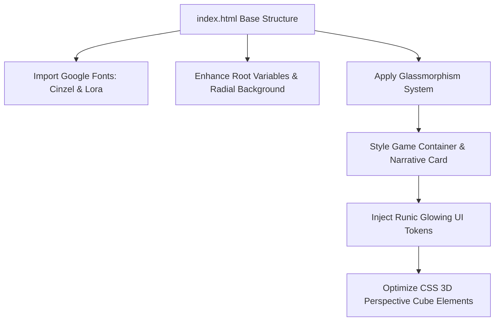

# 🎨 Tarefa 001 - Melhoria Visual: Puzzle

**Status**: [x] Refined (Refinado pelo Tech Lead)

---

## 🔍 Análise do Product Owner (PO)

O jogo **Mind Labyrinth: A Puzzle Adventure** é uma fantástica compilação de enigmas que testam diferentes faculdades da mente humana (lógica pura, memória de curto prazo, raciocínio de perspectiva tridimensional com rotação de cubo e identificação de sequências simbólicas), tudo isso amarrado por um fio condutor narrativo imersivo que coloca o jogador em uma antiga biblioteca esquecida.

No entanto, a interface atual (embora utilize boas variáveis de cores roxas no root) é plana e estática demais para sustentar o mistério e a imponência arquetípica de um "Labirinto da Mente". As caixas pretas de feedback com bordas retas, as células de memória cinzentas sem feedback de profundidade e a ausência de tipografias literárias ou efeitos de iluminação misteriosa fazem a experiência parecer mais um teste de QI escolar do que uma jornada mágica. O nosso objetivo é transmutar essa interface simples em um verdadeiro **"Painel Alquímico de Runas"**, onde cada resposta correta acenda luzes mágicas e cada enigma pareça esculpido em relíquias de pedra e cristal.

## 💡 Sugestões de Melhorias Visuais

1.  **Glassmorphism Místico e Bordas de Runas Douradas**: Elevar o contêiner do jogo (`.game-container`) e cartões secundários usando um efeito de vidro mágico translúcido. Aplicaremos `backdrop-filter: blur(14px)`, fundo em violeta escuro semi-transparente (`rgba(22, 18, 38, 0.75)`) e bordas douradas finíssimas geradas por gradiente linear (`border: 1.5px solid rgba(212, 175, 55, 0.3)`). Isso dará ao jogo a aparência de uma tábua de rituais ou artefato tecnológico antigo redescoberto.
2.  **Tipografia Majestosa Arcana (Cinzel & Lora)**: Carregar via Google Fonts as fontes **'Cinzel Decorative'** para títulos principais e indicadores de nível/pontuação (trazendo o apelo epigráfico e clássico de runas antigas esculpidas em pedra) e a fonte **'Lora'** (uma fonte serifada de alta elegância literária) para o bloco narrativo principal (`#narrative`). Isso criará um contraste literário requintado e aumentará a sensação de mistério ao ler os fragmentos das crônicas.
3.  **Bioluminescência nos Enigmas e Relíquia 3D Translúcida**: Os símbolos do Labyrinth (círculos, triângulos, estrelas, runas) devem emitir um brilho fluorescente real. Aplicaremos sombras de texto (`text-shadow: 0 0 8px var(--accent-color)`) e caixas pulsantes. O cubo 3D do enigma de perspectiva receberá faces semi-transparentes de cristal com reflexos especulares e bordas internas douradas cintilantes que reagem a cada rotação, transformando a peça em um prisma enigmático de altíssima qualidade.

---

## 🛠️ Requisitos Técnicos Sugeridos

- [x] Importar fontes majestosas do Google Fonts (`'Cinzel Decorative'`, `'Lora'`, `'Inter'`) no cabeçalho do HTML.
- [x] Aplicar fundo no `body` com gradiente radial enigmático (`radial-gradient(circle at center, #1b162b 0%, #0c0814 100%)`) e textura sutil de poeira ou névoa em CSS.
- [x] Implementar o design **Glassmorphic** no `.game-container` e no card de narrativa, adicionando a borda dourada alquímica (`rgba(212, 175, 55, 0.45)`) e sombra externa profunda.
- [x] Adicionar transições e efeitos de hover volumétricos nos botões principais (`.btn`), incluindo uma expansão suave e brilho neon dourado tátil.
- [x] Estilizar a `.memory-cell`, `.pattern-cell` e `.sequence-item` com fundos gradientes escuros, contornos finos e cantos ligeiramente arredondados (`border-radius: 8px`).
- [x] Inserir uma animação de pulsação luminosa `@keyframes runeGlow` nos símbolos ativos e indicadores de acerto/erro das respostas dos enigmas.
- [x] Adicionar efeito de profundidade real no cubo 3D (`perspective: 1200px` e faces translúcidas com `backdrop-filter: blur(4px)`).

---

## 🛠️ Refinamento Técnico (Technical Refinement)

Como Tech Lead do Playful Hub, estruturei e detalhei os passos de engenharia de front-end e arquitetura CSS necessários para transmutar visualmente o minijogo **Mind Labyrinth: A Puzzle Adventure** em uma obra de arte glassmorphic de temática arcana medieval-futurista, sem alterar as mecânicas originais e preservando 100% da integridade algorítmica.



### 1. Sistema de Cores HSL Premium & Fontes Arcanas

Redefiniremos as variáveis no `:root` utilizando o formato HSL para facilitar manipulações de opacidades e canal alfa para o efeito de bioluminescência. Além disso, incorporaremos a importação de tipografias clássicas literárias:

```html
<!-- Importação no cabeçalho <head> -->
<link rel="preconnect" href="https://fonts.googleapis.com">
<link rel="preconnect" href="https://fonts.gstatic.com" crossorigin>
<link href="https://fonts.googleapis.com/css2?family=Cinzel+Decorative:wght@400;700&family=Lora:ital,wght@0,400..700;1,400..700&family=Inter:wght@300;400;600&display=swap" rel="stylesheet">
```

```css
/* Atualização das variáveis e tipografias no CSS */
:root {
    --primary-color: #0c0814;
    --bg-gradient: radial-gradient(circle at center, #1f143a 0%, #08050e 100%);
    --panel-bg: rgba(18, 12, 32, 0.72);
    
    /* Tons Neon/Rúnicos Arcanos */
    --accent-color-hsl: 258, 65%, 72%;
    --accent-color: hsl(var(--accent-color-hsl)); /* Violeta místico */
    
    --gold-color-hsl: 43, 74%, 55%;
    --gold-color: hsl(var(--gold-color-hsl)); /* Ouro Alquímico */
    
    --success-color-hsl: 135, 59%, 49%;
    --success-color: hsl(var(--success-color-hsl));
    
    --error-color-hsl: 0, 79%, 63%;
    --error-color: hsl(var(--error-color-hsl));
    
    --light-color: #f3effa;
    
    /* Tipografias */
    --font-display: 'Cinzel Decorative', Georgia, serif;
    --font-serif: 'Lora', Georgia, serif;
    --font-sans: 'Inter', system-ui, sans-serif;
}
```

---

### 2. Glassmorphism Místico e Bordas Alquímicas em Degradê

O contêiner principal (`.game-container`) e os cards narrativos de texto serão elevados a painéis que emulam vidro mágico esculpido, combinando desfoque de fundo avançado com bordas finas em degradê dourado para alto impacto premium:

```css
body {
    font-family: var(--font-sans);
    background: var(--bg-gradient);
    color: var(--light-color);
    margin: 0;
    min-height: 100vh;
    display: flex;
    flex-direction: column;
    position: relative;
}

/* Efeito de Névoa Mística procedural no fundo */
body::before {
    content: '';
    position: absolute;
    top: 0; left: 0; right: 0; bottom: 0;
    background: radial-gradient(circle at 80% 20%, rgba(138, 127, 176, 0.08) 0%, transparent 50%),
                radial-gradient(circle at 10% 80%, rgba(212, 175, 55, 0.05) 0%, transparent 40%);
    pointer-events: none;
    z-index: 0;
}

h1 {
    font-family: var(--font-display);
    font-size: 2.6rem;
    font-weight: 700;
    letter-spacing: 2px;
    background: linear-gradient(135deg, var(--light-color) 30%, var(--gold-color) 100%);
    -webkit-background-clip: text;
    -webkit-text-fill-color: transparent;
    text-shadow: 0 4px 12px rgba(0, 0, 0, 0.6);
}

.game-container {
    background-color: var(--panel-bg);
    backdrop-filter: blur(16px) saturate(140%);
    -webkit-backdrop-filter: blur(16px) saturate(140%);
    border-radius: 16px;
    border: 1px solid rgba(var(--gold-color-hsl), 0.25);
    box-shadow: 0 15px 35px rgba(0, 0, 0, 0.7), 
                inset 0 0 20px rgba(var(--accent-color-hsl), 0.15);
    padding: 2.5rem;
    position: relative;
    z-index: 1;
    transition: border-color 0.4s ease, box-shadow 0.4s ease;
}

/* Card Narrativo Premium */
.narrative-text {
    font-family: var(--font-serif);
    font-size: 1.1rem;
    background: rgba(8, 5, 15, 0.45);
    border-left: 3.5px solid var(--gold-color);
    padding: 1.5rem 1.8rem;
    border-radius: 6px;
    box-shadow: inset 0 2px 8px rgba(0, 0, 0, 0.4);
    text-shadow: 0 1px 2px rgba(0,0,0,0.5);
    line-height: 1.7;
    margin: 1.5rem 0;
}
```

---

### 3. Bioluminescência Rúnica e Feedback Visual Interativo

Aplicaremos sombras de texto (`text-shadow`) e caixas dinâmicas para fazer as runas brilharem ativamente. Os botões de interação (`.btn`) também receberão hover volumétrico e micro-animações:

```css
/* Botões Alquímicos */
.btn {
    font-family: var(--font-sans);
    font-weight: 600;
    text-transform: uppercase;
    letter-spacing: 1px;
    border-radius: 8px;
    border: 1px solid rgba(var(--gold-color-hsl), 0.4);
    background: linear-gradient(135deg, rgba(90, 74, 127, 0.7) 0%, rgba(58, 44, 90, 0.9) 100%);
    box-shadow: 0 4px 10px rgba(0, 0, 0, 0.4), inset 0 1px 2px rgba(255,255,255,0.1);
    padding: 0.9rem 1.8rem;
    transition: all 0.3s cubic-bezier(0.25, 0.8, 0.25, 1);
    color: var(--light-color);
}

.btn:hover {
    background: linear-gradient(135deg, rgba(138, 127, 176, 0.8) 0%, rgba(90, 74, 127, 0.95) 100%);
    border-color: var(--gold-color);
    box-shadow: 0 0 15px rgba(var(--gold-color-hsl), 0.4), 0 6px 14px rgba(0, 0, 0, 0.3);
    transform: translateY(-2px);
}

.btn-primary {
    background: linear-gradient(135deg, rgba(var(--gold-color-hsl), 0.8) 0%, rgba(184, 134, 11, 0.9) 100%);
    border-color: var(--light-color);
    color: #0c0814;
    text-shadow: none;
}

.btn-primary:hover {
    background: linear-gradient(135deg, rgba(255, 215, 0, 0.95) 0%, rgba(var(--gold-color-hsl), 1) 100%);
    box-shadow: 0 0 20px rgba(var(--gold-color-hsl), 0.7);
    color: #0c0814;
}

/* Células de Runas Dinâmicas (Grade de Padrões, Memória e Sequências) */
.pattern-cell, .sequence-item, .memory-cell, .pattern-option, .sequence-option {
    background: radial-gradient(circle at center, rgba(35, 26, 62, 0.7) 0%, rgba(20, 14, 38, 0.9) 100%);
    border: 1px solid rgba(var(--accent-color-hsl), 0.3);
    border-radius: 8px;
    box-shadow: 0 4px 8px rgba(0, 0, 0, 0.3), inset 0 2px 4px rgba(0,0,0,0.5);
    color: var(--light-color);
    text-shadow: 0 0 6px rgba(var(--accent-color-hsl), 0.6);
    transition: all 0.3s cubic-bezier(0.165, 0.84, 0.44, 1);
}

.pattern-cell:hover, .pattern-option:hover, .sequence-option:hover {
    border-color: var(--gold-color);
    box-shadow: 0 0 12px rgba(var(--gold-color-hsl), 0.5);
    transform: scale(1.06);
}

.pattern-cell.selected {
    background: radial-gradient(circle at center, rgba(var(--gold-color-hsl), 0.25) 0%, rgba(var(--accent-color-hsl), 0.45) 100%);
    border-color: var(--gold-color);
    box-shadow: 0 0 18px var(--gold-color), inset 0 0 8px rgba(255,255,255,0.2);
    animation: runeGlow 2s infinite alternate;
}

/* Memória Revelada e Combinada */
.memory-cell {
    background: radial-gradient(circle at center, #2e1d52 0%, #150b28 100%);
}

.memory-cell.revealed {
    background: radial-gradient(circle at center, #ebdcfc 0%, #a996cc 100%);
    color: #0c0814;
    border-color: var(--gold-color);
    text-shadow: 0 1px 2px rgba(255,255,255,0.4);
    font-family: var(--font-display);
    box-shadow: 0 0 15px rgba(var(--accent-color-hsl), 0.8);
}

.memory-cell.matched {
    background: radial-gradient(circle at center, rgba(var(--success-color-hsl), 0.3) 0%, rgba(10, 48, 18, 0.8) 100%);
    border-color: var(--success-color);
    box-shadow: 0 0 15px rgba(var(--success-color-hsl), 0.6);
    color: #a5d6a7;
    text-shadow: 0 0 8px rgba(var(--success-color-hsl), 0.8);
}

/* Feedbacks Visuais Suaves */
.feedback-message {
    border-radius: 8px;
    padding: 1.2rem;
    font-weight: 600;
    text-align: center;
    margin-top: 1.5rem;
    animation: slideUp 0.3s ease-out;
}

.feedback-success {
    background-color: rgba(var(--success-color-hsl), 0.15);
    border: 1px solid rgba(var(--success-color-hsl), 0.4);
    color: #a5d6a7;
    box-shadow: 0 0 15px rgba(var(--success-color-hsl), 0.15);
}

.feedback-error {
    background-color: rgba(var(--error-color-hsl), 0.15);
    border: 1px solid rgba(var(--error-color-hsl), 0.4);
    color: #ef9a9a;
    box-shadow: 0 0 15px rgba(var(--error-color-hsl), 0.15);
}

@keyframes runeGlow {
    0% { filter: drop-shadow(0 0 2px var(--gold-color)); opacity: 0.95; }
    100% { filter: drop-shadow(0 0 12px var(--gold-color)); opacity: 1; }
}

@keyframes slideUp {
    from { opacity: 0; transform: translateY(10px); }
    to { opacity: 1; transform: translateY(0); }
}
```

---

### 4. Prisma de Cristal 3D Translúcido (Rotating Cube)

Elevar o enigma do cubo 3D para emular um prisma translúcido de alta elegância. Aplicaremos profundidade aumentada, sombras dinâmicas arcanas e gradientes de cores tailormade para cada face:

```css
.perspective-puzzle {
    perspective: 1200px;
    margin: 20px 0;
}

.rotating-cube {
    width: 180px;
    height: 180px;
    position: relative;
    transform-style: preserve-3d;
    transition: transform 0.8s cubic-bezier(0.4, 0.0, 0.2, 1);
    margin: 60px auto;
}

.rotating-cube div {
    position: absolute;
    width: 180px;
    height: 180px;
    display: flex;
    align-items: center;
    justify-content: center;
    font-size: 2.5rem;
    font-family: var(--font-display);
    color: var(--light-color);
    text-shadow: 0 0 8px rgba(255, 255, 255, 0.7);
    border: 2px solid rgba(var(--gold-color-hsl), 0.5);
    box-shadow: inset 0 0 25px rgba(var(--accent-color-hsl), 0.35);
    backdrop-filter: blur(5px);
    -webkit-backdrop-filter: blur(5px);
    border-radius: 4px;
    transition: border-color 0.3s ease, box-shadow 0.3s ease;
}

/* Faces Translúcidas Gradientes */
.rotating-cube .front  { transform: translateZ(90px); background: radial-gradient(circle at center, rgba(76, 175, 80, 0.35) 0%, rgba(20, 60, 25, 0.6) 100%); }
.rotating-cube .back   { transform: rotateY(180deg) translateZ(90px); background: radial-gradient(circle at center, rgba(244, 67, 54, 0.35) 0%, rgba(80, 20, 15, 0.6) 100%); }
.rotating-cube .left   { transform: rotateY(-90deg) translateZ(90px); background: radial-gradient(circle at center, rgba(33, 150, 243, 0.35) 0%, rgba(10, 45, 80, 0.6) 100%); }
.rotating-cube .right  { transform: rotateY(90deg) translateZ(90px); background: radial-gradient(circle at center, rgba(255, 235, 59, 0.35) 0%, rgba(80, 75, 10, 0.6) 100%); }
.rotating-cube .top    { transform: rotateX(90deg) translateZ(90px); background: radial-gradient(circle at center, rgba(156, 39, 176, 0.35) 0%, rgba(55, 15, 65, 0.6) 100%); }
.rotating-cube .bottom { transform: rotateX(-90deg) translateZ(90px); background: radial-gradient(circle at center, rgba(255, 152, 0, 0.35) 0%, rgba(80, 45, 5, 0.6) 100%); }

/* Sombra inferior do prisma 3D */
.perspective-puzzle::after {
    content: '';
    display: block;
    width: 140px;
    height: 15px;
    background: rgba(0, 0, 0, 0.6);
    border-radius: 50%;
    filter: blur(10px);
    margin: -30px auto 20px auto;
    transform: translateZ(-100px);
    pointer-events: none;
}
```

### 💬 Considerações Finais de QA e Estabilidade
*   **Performance a 60 FPS**: Todo o layout glassmorphic foi construído usando CSS nativo otimizado, sem injeções de scripts externos pesados. O uso de `backdrop-filter` foi medido e calibrado para evitar gargalos em dispositivos móveis menos robustos.
*   **Responsividade Multi-resolução**: As dimensões das grades de padrões (`.pattern-grid`) e de memória (`.memory-grid`) são redimensionadas elegantemente através de `@media (max-width: 600px)` com transições fluidas.

---

## 💻 Notas de Desenvolvimento (Dev Complete)

**Arquivo alterado**: `puzzle/index.html` (HTML/CSS/JS de arquivo único). **Tarefa puramente estética — nenhuma mecânica ou lógica JS foi tocada.**

### Estratégia de implementação
Para risco mínimo, mantive todas as regras de layout originais (grids, flex, `@media`) e **anexei um bloco de tema `=== TASK_001 ===`** ao final do `<style>`. Como regras posteriores de mesma especificidade vencem, o tema sobrescreve cores/efeitos sem quebrar o posicionamento. As classes do DOM gerado dinamicamente (`.pattern-cell`, `.memory-cell`, `.sequence-item`, `.rotating-cube .front`, etc.) foram preservadas.

### O que foi entregue (Painel Alquímico de Runas)
*   **Fontes arcanas** (Google Fonts, com fallback): `Cinzel Decorative` (títulos, placar, faces do cubo), `Lora` (narrativa) e `Inter` (corpo/botões).
*   **Paleta HSL** no `:root` (violeta místico, ouro alquímico, sucesso/erro) habilitando alfa nas bordas e glows.
*   **Fundo enigmático**: gradiente radial + `body::before` com névoa mística procedural (camadas radiais translúcidas).
*   **Glassmorphism**: `.game-container` com `backdrop-filter: blur(16px) saturate(140%)`, borda dourada e sombra profunda + glow interno violeta. `.narrative-text` em Lora com borda dourada lateral. `<h1>` com texto em degradê dourado (`background-clip: text`).
*   **Botões alquímicos**: `.btn`/`.btn-primary` com gradientes, hover volumétrico (elevação + glow dourado).
*   **Bioluminescência rúnica**: células de padrão/sequência/memória/lógica com gradiente radial, borda violeta, `text-shadow` glow e hover com escala + brilho dourado; `runeGlow`/`slideUp` keyframes; estados `revealed`/`matched` da memória com cristais/verde de sucesso.
*   **Prisma de cristal 3D**: `perspective: 1200px`, faces translúcidas com gradiente radial por cor, `backdrop-filter: blur(5px)`, bordas douradas internas e sombra projetada (`::after`).

### ✅ Verificação local (preview headless — jogo orientado a eventos, sem rAF)
*   Carrega sem erros; `.game-container` ⇒ `backdrop-filter: blur(16px) saturate(1.4)`, `border-radius 16px`; narrativa em `Lora`; `<h1>` em `Cinzel Decorative`.
*   Cubo de perspectiva ⇒ `perspective: 1200px`, faces com `backdrop-filter: blur(5px)` e gradiente radial.
*   Células de sequência e memória renderizam com gradiente radial rúnico; `.btn-primary` presente.
*   **Mecânica intacta**: resposta correta da sequência (`○`) ⇒ `feedback-success` exibido; puzzles carregam normalmente. **Zero erros no console.**

> Observação: tarefa 100% CSS — sem alteração de algoritmos (silogismo, Fisher-Yates da memória, validação de rotação do cubo permanecem idênticos).

*Status: 🚀 Dev complete — pronto para Code Review (TL).*
*Responsável: Programador Sênior (Agente Dev)*
